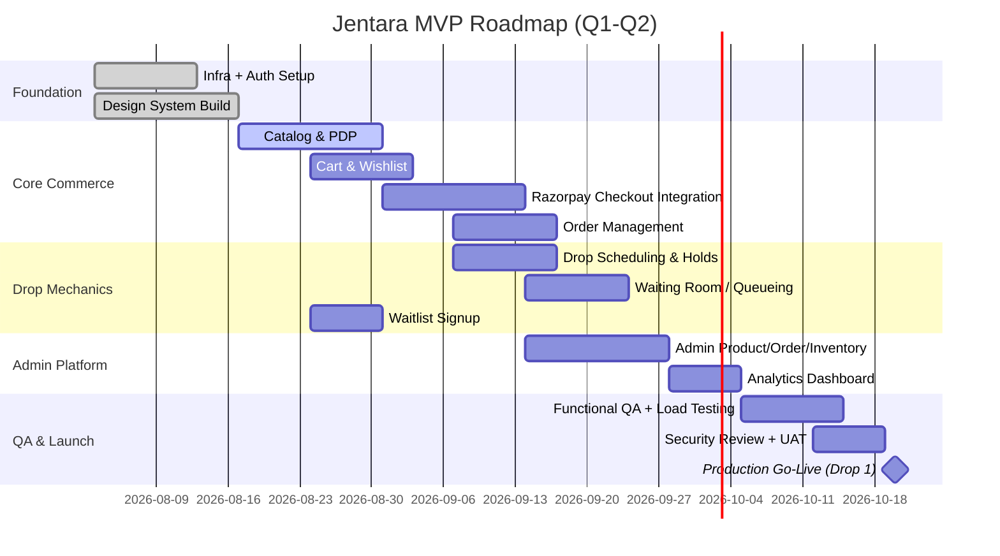
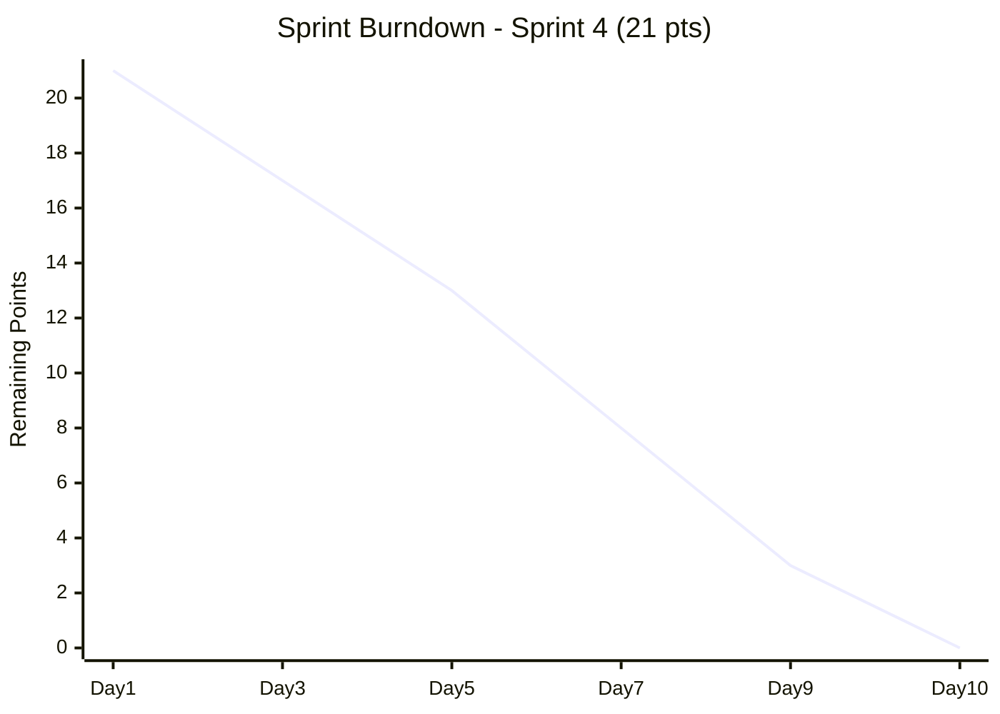
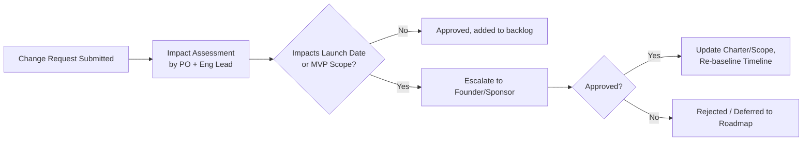
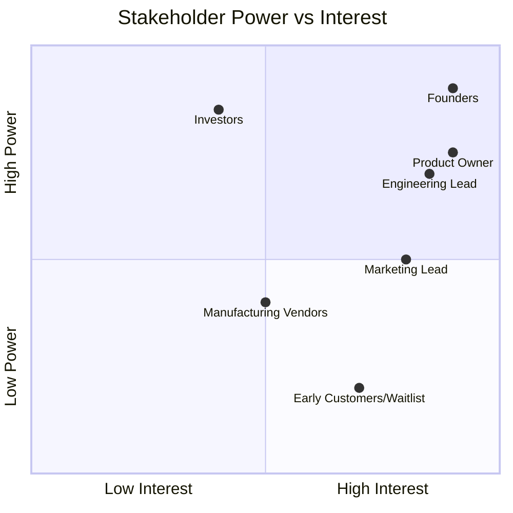

# Section 8 — Agile Project Management
### Jentara | Charter, Roadmap, Sprints & Governance

---

## 8.1 Project Charter

| Field | Detail |
|---|---|
| Project Name | Jentara D2C Platform — MVP Launch |
| Sponsor | Founders / CEO |
| Product Owner | Head of Product |
| Project Goal | Launch a production-ready D2C storefront + admin platform supporting drop-based commerce, live for Drop 1 within Q1 |
| Business Justification | Capture whitespace in Indian streetwear (mythology/futurism niche); validate drop-based model with real GMV |
| Success Criteria | MVP live, Drop 1 achieves ≥80% sell-through, checkout success rate ≥98%, zero critical security incidents |
| Constraints | Lean team, fixed Q1 launch deadline tied to marketing/waitlist campaign, budget capped per Section 12 (Finance) |
| Assumptions | Razorpay merchant account approved in time; vendor/manufacturing partners ready for Drop 1 inventory by Week 5 |

## 8.2 Scope & Deliverables

| Deliverable | Owner | Linked Section |
|---|---|---|
| Storefront (browse, cart, checkout, orders) | Engineering | 05-PRD, 07-Architecture |
| Razorpay payment integration | Engineering | 07-Architecture |
| Admin dashboard (products, orders, inventory, analytics) | Engineering | 05-PRD |
| Design system & UI components | Design | 06-UX |
| Drop 1 collection content (lore, imagery, sustainability data) | Brand/Content | 04-Product-Strategy |
| Launch marketing campaign | Marketing | 11-Marketing |
| QA sign-off & security review | QA/Engineering | 10-PMO |

## 8.3 Work Breakdown Structure (WBS)

```mermaid
graph TD
P[Jentara MVP Launch] --> A[1. Foundation]
P --> B[2. Core Commerce]
P --> C[3. Drop Mechanics]
P --> D[4. Admin Platform]
P --> E[5. QA & Launch Readiness]
P --> F[6. Go-Live]

A --> A1[Auth - Supabase]
A --> A2[Design System Build]
A --> A3[Infra Setup - Vercel/Supabase/Razorpay]

B --> B1[Catalog & PDP]
B --> B2[Cart & Wishlist]
B --> B3[Checkout + Razorpay Integration]
B --> B4[Order Management]

C --> C1[Drop Scheduling]
C --> C2[Inventory Hold Logic]
C --> C3[Waiting Room / Queueing]
C --> C4[Waitlist Signup]

D --> D1[Admin Product Mgmt]
D --> D2[Admin Order Mgmt]
D --> D3[Admin Inventory Mgmt]
D --> D4[Analytics Dashboard]

E --> E1[Functional QA]
E --> E2[Load Testing - Drop Simulation]
E --> E3[Security Review]
E --> E4[UAT with Stakeholders]

F --> F1[Production Deployment]
F --> F2[Drop 1 Content Upload]
F --> F3[Launch Monitoring]
```

## 8.4 Timeline & Quarterly Roadmap

### Monthly Roadmap Summary

| Month | Focus | Key Milestone |
|---|---|---|
| Month 1 | Foundation: infra, auth, design system | Dev environment + design system locked |
| Month 2 | Core commerce: catalog, cart, Razorpay checkout | Checkout flow functional end-to-end |
| Month 3 | Drop mechanics + admin platform | Admin dashboard usable by ops team |
| Month 3.5 | QA, load testing, security review, UAT | Go/No-Go sign-off |
| Month 4 (Week 3) | **Production Launch — Drop 1** | Live to public |

## 8.5 Sprint Planning (2-Week Sprints)

| Sprint | Sprint Goal | Key Backlog Items |
|---|---|---|
| Sprint 1 | Infra & auth foundation | Supabase project setup, Vercel CI/CD, Auth (email/OTP) |
| Sprint 2 | Design system + catalog data model | Component library, product/variant schema, PDP skeleton |
| Sprint 3 | Cart & wishlist | Cart CRUD, wishlist CRUD, inventory hold data model |
| Sprint 4 | Razorpay checkout (part 1) | Order creation, Razorpay SDK integration, signature verification |
| Sprint 5 | Razorpay checkout (part 2) + Order mgmt | Webhook handler, order status flow, order history UI |
| Sprint 6 | Drop mechanics | Drop scheduling, countdown, per-account purchase limits |
| Sprint 7 | Waiting room + waitlist | Queueing service, waitlist signup + email notifications |
| Sprint 8 | Admin platform | Product/inventory/order admin screens |
| Sprint 9 | Analytics + polish | Admin analytics dashboard, coupon engine, reviews |
| Sprint 10 | QA, load testing, security, UAT | Bug fixes, drop-day load simulation, sign-off |

### Sample Sprint Backlog (Sprint 4 — Razorpay Checkout Part 1)

| Story | Points | Owner |
|---|---|---|
| Create Razorpay order on checkout-initiate | 5 | Backend |
| Integrate Razorpay Checkout SDK on frontend | 5 | Frontend |
| Implement HMAC signature verification | 3 | Backend |
| Inventory hold creation + TTL expiry job | 5 | Backend |
| Checkout UI states (loading/error/retry) | 3 | Frontend |
| **Sprint Total** | **21** | |

## 8.6 Velocity & Burndown

| Sprint | Planned Points | Completed Points |
|---|---|---|
| Sprint 1 | 18 | 16 |
| Sprint 2 | 20 | 19 |
| Sprint 3 | 21 | 20 |
| Sprint 4 | 21 | 18 |
| Sprint 5 | 22 | — (in progress) |

**Rolling average velocity (Sprints 1–4): ~18.25 points/sprint** — used for forecasting Sprints 6–10 capacity.

## 8.7 Release Planning & Milestones

| Release | Contents | Target Date |
|---|---|---|
| Internal Alpha | Core commerce flow, test-mode Razorpay | End of Month 2 |
| Closed Beta | + Drop mechanics, waitlist, invited testers | Mid Month 3 |
| Release Candidate | + Admin platform, analytics, full QA pass | End of Month 3 |
| **V1.0 Production Launch (Drop 1)** | Full MVP scope live | Month 4, Week 3 |
| V1.1 | Coupons refinement, review moderation tools | Month 5 |

## 8.8 Risk Register

| ID | Risk | Likelihood | Impact | Mitigation | Owner |
|---|---|---|---|---|---|
| R1 | Razorpay merchant account approval delayed | Medium | High | Apply early (Week 1); have test-mode fallback for dev | Founder/Ops |
| R2 | Drop-day traffic exceeds load-test assumptions | Medium | High | Waiting-room queue + conservative capacity buffer; pre-launch load test at 15x baseline | Engineering |
| R3 | Manufacturing/vendor delay affects Drop 1 inventory readiness | Medium | High | Buffer 2-week lead time; secondary vendor on standby | Ops |
| R4 | Scope creep from stakeholder requests pre-launch | High | Medium | Strict MoSCoW enforcement; changes go through Change Request process (8.11) | Product Owner |
| R5 | Security vulnerability in payment flow | Low | Critical | Mandatory security review + penetration test before go-live | Engineering/QA |
| R6 | Key engineering resource unavailability | Low | Medium | Cross-training, documented architecture (Section 7) | Eng Lead |
| R7 | Sustainability claims challenged publicly (credibility risk) | Low | High | Vendor audits completed and published before marketing claims go live | Brand/Ops |

## 8.9 Issue Log (Template)

| ID | Issue | Raised By | Date | Status | Resolution |
|---|---|---|---|---|---|
| ISS-01 | Example: Razorpay test webhook not firing in local dev | Backend Eng | Sprint 4 | Resolved | Used ngrok tunnel for local webhook testing |
| ISS-02 | *(template row — populate during execution)* | | | Open/Resolved | |

## 8.10 Communication Plan

| Meeting | Frequency | Attendees | Purpose |
|---|---|---|---|
| Daily Standup | Daily, 15 min | Dev team, PO | Progress, blockers |
| Sprint Planning | Every 2 weeks | Dev team, PO, Design | Commit sprint backlog |
| Sprint Review/Demo | Every 2 weeks | Dev team, PO, Founders, Marketing | Demo increment, gather feedback |
| Sprint Retrospective | Every 2 weeks | Dev team, PO | Continuous improvement |
| Stakeholder Sync | Bi-weekly | Founders, PO, Eng Lead, Marketing Lead | Cross-functional alignment, roadmap review |
| Risk Review | Monthly | PO, Eng Lead, Ops | Review/update Risk Register |

## 8.11 Change Management Process

## 8.12 RACI Matrix

| Activity | Product Owner | Eng Lead | Design Lead | Marketing Lead | Founder |
|---|---|---|---|---|---|
| PRD sign-off | A | C | C | I | I |
| Architecture decisions | I | A | I | I | I |
| Sprint planning | R | R | C | I | I |
| Drop 1 content readiness | C | I | R | A | I |
| Go/No-Go launch decision | C | C | C | C | A |
| Security review sign-off | I | R | I | I | A |
| Marketing campaign execution | I | I | C | A/R | I |

*(R = Responsible, A = Accountable, C = Consulted, I = Informed)*

## 8.13 Stakeholder Matrix

| Stakeholder | Engagement Strategy |
|---|---|
| Founders | Manage closely — bi-weekly stakeholder sync, final Go/No-Go authority |
| Investors | Keep satisfied — monthly summary updates, milestone reports |
| Engineering/Product/Design leads | Manage closely — daily/sprint cadence |
| Manufacturing vendors | Keep informed — timeline dependencies tracked in Risk Register |
| Early customers/waitlist | Monitor — community channel updates, no formal governance role |

## 8.14 Meeting Templates

**Sprint Retrospective Template:**
- What went well?
- What didn't go well?
- What will we try differently next sprint?
- Action items (owner + due date)

**Sprint Review/Demo Template:**
- Sprint goal recap
- Live demo of completed increment
- Metrics update (velocity, burndown)
- Stakeholder feedback capture
- Backlog re-prioritization inputs

---
**Previous section:** [`07-Architecture`](../07-Architecture/Architecture.md)
**Next section:** [`09-Jira`](../09-Jira/Jira-Templates.md)
