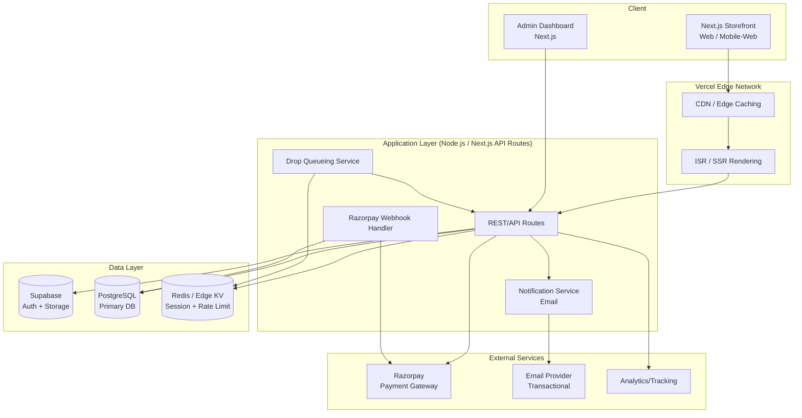
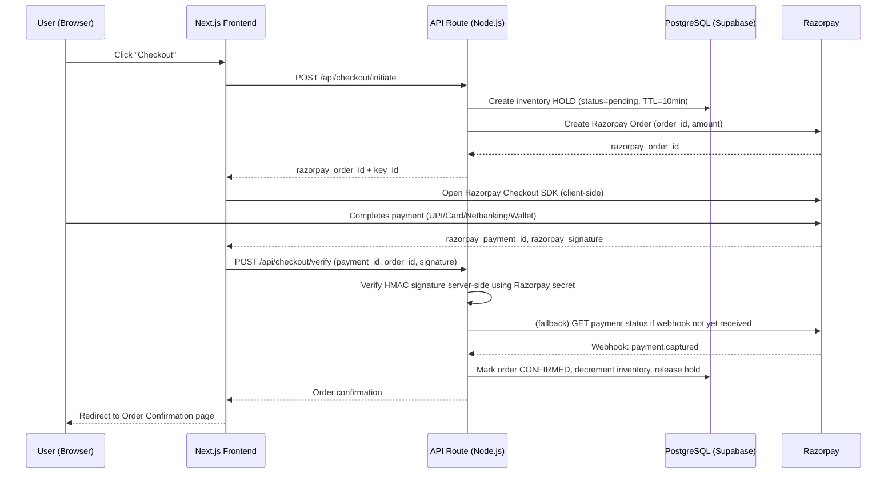
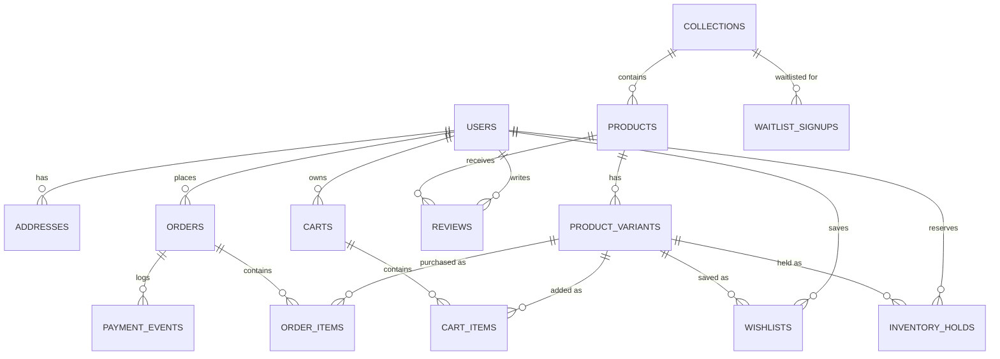
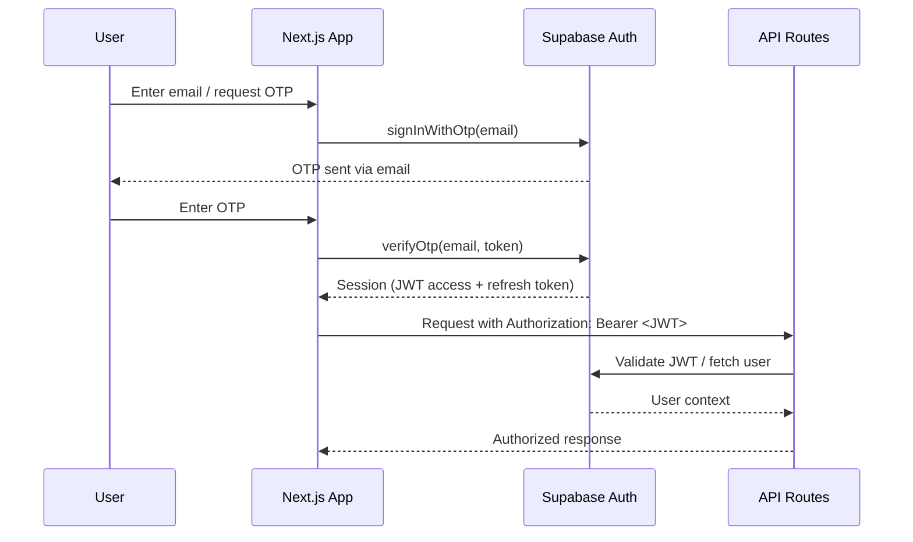
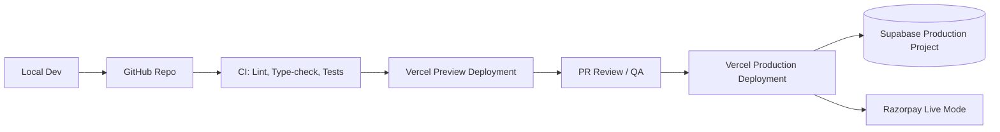

# Section 7 — Technical Architecture
### Jentara | System Design, Data Model & API Specification

**Stack:** Next.js (TypeScript) · Tailwind CSS · Node.js · Supabase (Auth/Storage) · PostgreSQL · Razorpay · Vercel

---

## 7.1 High-Level Architecture (HLD)



**Architecture Principles:**
1. **Composable, not monolithic** — each concern (auth, storage, payments) is a managed service, minimizing custom infrastructure to maintain.
2. **Edge-first rendering** — product/catalog pages are served via ISR (Incremental Static Regeneration) with short revalidation windows for near-real-time stock accuracy without full SSR cost on every request.
3. **Payment verification is server-authoritative** — the client never marks an order "Confirmed"; only a verified Razorpay webhook (or server-side payment status poll) can do so.
4. **Inventory correctness over raw speed during drops** — the queueing layer trades a few seconds of user wait time for guaranteed no-oversell correctness.

## 7.2 Low-Level Architecture — Checkout & Payment Flow



**Critical security note:** Signature verification (HMAC-SHA256 using the Razorpay key secret) happens **only server-side**, on both the `/verify` call and the async webhook, so that a client-side response can never be spoofed to fake a successful order.

## 7.3 Database Design — Core Schema (Simplified)

| Table | Key Columns |
|---|---|
| `users` | id, email, phone, auth_provider, created_at (mirrors Supabase Auth `auth.users`) |
| `addresses` | id, user_id (FK), line1, city, state, pincode, is_default |
| `products` | id, name, slug, description, story_content, collection_id (FK), sustainability_meta |
| `product_variants` | id, product_id (FK), size, color, sku, price, stock_qty |
| `collections` | id, name, slug, drop_start_time, drop_end_time, is_limited |
| `inventory_holds` | id, variant_id (FK), user_id (FK), quantity, status, expires_at |
| `orders` | id, user_id (FK), status, razorpay_order_id, razorpay_payment_id, total_amount, created_at |
| `order_items` | id, order_id (FK), variant_id (FK), quantity, unit_price |
| `carts` | id, user_id (FK), created_at |
| `cart_items` | id, cart_id (FK), variant_id (FK), quantity |
| `wishlists` | id, user_id (FK), variant_id (FK) |
| `coupons` | id, code, discount_type, discount_value, valid_from, valid_to, usage_limit |
| `reviews` | id, product_id (FK), user_id (FK), rating, comment, created_at |
| `waitlist_signups` | id, email, collection_id (FK), signed_up_at |
| `payment_events` | id, order_id (FK), razorpay_event_id, event_type, payload_json, received_at |

## 7.4 ER Diagram



## 7.5 API Documentation (Core Endpoints)

| Method | Endpoint | Description | Auth |
|---|---|---|---|
| `GET` | `/api/products` | List products with filters (collection, size, color, price) | Public |
| `GET` | `/api/products/:slug` | Get single product detail | Public |
| `POST` | `/api/cart/items` | Add item to cart | User |
| `DELETE` | `/api/cart/items/:id` | Remove item from cart | User |
| `POST` | `/api/checkout/initiate` | Create inventory hold + Razorpay order | User |
| `POST` | `/api/checkout/verify` | Verify Razorpay payment signature, confirm order | User |
| `POST` | `/api/webhooks/razorpay` | Razorpay server-to-server webhook receiver | Signed (Razorpay) |
| `GET` | `/api/orders` | List authenticated user's orders | User |
| `GET` | `/api/orders/:id` | Get order detail/status | User |
| `POST` | `/api/orders/:id/return` | Submit return/exchange request | User |
| `POST` | `/api/waitlist` | Join a drop waitlist | Public |
| `POST` | `/api/reviews` | Submit a product review | User |
| `GET` | `/api/admin/orders` | List/manage all orders | Admin |
| `PATCH` | `/api/admin/orders/:id` | Update order status | Admin |
| `POST` | `/api/admin/products` | Create product/variant | Admin |
| `PATCH` | `/api/admin/inventory/:variantId` | Update stock quantity | Admin |
| `GET` | `/api/admin/analytics` | Sales/traffic summary metrics | Admin |

### Sample Payload — `POST /api/checkout/verify`

```json
{
  "razorpay_order_id": "order_ABC123",
  "razorpay_payment_id": "pay_XYZ789",
  "razorpay_signature": "generated_hmac_signature",
  "cart_id": "cart_9f21..."
}
```

### Sample Response

```json
{
  "status": "confirmed",
  "order_id": "ord_5521",
  "order_status": "processing",
  "estimated_delivery": "2026-08-02"
}
```

## 7.6 Authentication Flow (Supabase Auth)



Row-Level Security (RLS) policies are enforced directly in PostgreSQL via Supabase so that, for example, a user can only `SELECT`/`UPDATE` rows in `orders` or `addresses` where `user_id = auth.uid()`.

## 7.7 Folder Structure (Next.js App Router)

```
jentara/
├── app/
│   ├── (storefront)/
│   │   ├── page.tsx                 # Home
│   │   ├── drops/[slug]/page.tsx
│   │   ├── shop/page.tsx
│   │   ├── product/[slug]/page.tsx
│   │   ├── cart/page.tsx
│   │   ├── checkout/page.tsx
│   │   └── account/
│   ├── (admin)/
│   │   ├── admin/products/page.tsx
│   │   ├── admin/orders/page.tsx
│   │   ├── admin/inventory/page.tsx
│   │   └── admin/analytics/page.tsx
│   └── api/
│       ├── products/route.ts
│       ├── cart/route.ts
│       ├── checkout/initiate/route.ts
│       ├── checkout/verify/route.ts
│       ├── webhooks/razorpay/route.ts
│       └── admin/**
├── components/
│   ├── ui/               # Buttons, Modals, Badges (design system components)
│   ├── product/
│   ├── cart/
│   └── admin/
├── lib/
│   ├── supabase/         # client, server, admin clients
│   ├── razorpay/         # order creation, signature verification
│   └── validation/       # zod schemas
├── types/
├── styles/
└── tests/
```

## 7.8 Deployment Architecture



| Environment | Purpose | Razorpay Mode |
|---|---|---|
| Local | Development | Test mode |
| Preview (per-PR) | Stakeholder review, QA | Test mode |
| Staging | Pre-prod validation, load testing | Test mode |
| Production | Live traffic | Live mode |

## 7.9 Caching Strategy

| Layer | Approach |
|---|---|
| Static/Catalog pages | ISR with short revalidation (e.g., 60s) so stock/price stay near-real-time without full SSR cost |
| Edge CDN | Vercel Edge Network caches static assets, images (via Supabase Storage + CDN) |
| Session/Rate-limit data | Redis/Edge KV for inventory hold counters and per-user rate limiting during drops |
| API responses | Short-TTL cache on read-heavy, low-volatility endpoints (e.g., collection listings) |

## 7.10 Performance Optimization

| Technique | Applied To |
|---|---|
| Image optimization (Next.js Image, responsive `srcset`) | Product imagery, hero banners |
| Code-splitting / dynamic imports | Admin dashboard, checkout modal (Razorpay SDK loaded on-demand) |
| Edge-rendered PDP/catalog pages | Reduces Time-to-First-Byte globally |
| Database indexing | `product_variants(sku)`, `orders(user_id, status)`, `inventory_holds(expires_at)` |
| Connection pooling | Supabase's PgBouncer pooling for serverless API route DB connections |
| Queueing/backpressure | Waiting-room mechanism prevents DB overload during drop-launch traffic spikes |

## 7.11 Security

| Area | Control |
|---|---|
| Payment data | No card data touches Jentara servers — handled entirely within Razorpay's PCI-DSS compliant SDK/hosted checkout |
| Webhook integrity | Razorpay webhook signature (HMAC-SHA256) verified before processing any payment event |
| Auth | Supabase Auth (JWT-based), short-lived access tokens + refresh token rotation |
| Data access | PostgreSQL Row-Level Security on all user-scoped tables |
| Input validation | Schema validation (e.g., Zod) on all API route inputs |
| Rate limiting | Applied to auth endpoints and checkout-initiate endpoint to prevent abuse/bot drop-sniping |
| Secrets management | Razorpay keys, Supabase service role key stored in Vercel encrypted environment variables, never client-exposed |
| Admin access | Role-based access control (RBAC) — admin routes protected by server-side role check, not just UI hiding |

## 7.12 Scalability

| Concern | Strategy |
|---|---|
| Drop-day traffic spikes | Edge caching + waiting-room queue throttles write-heavy requests (checkout-initiate) to a sustainable rate |
| Database write contention on inventory | Row-level locking / atomic decrement operations on `product_variants.stock_qty`; short-lived holds prevent long lock windows |
| Horizontal scaling | Vercel serverless functions auto-scale API routes; Supabase Postgres can scale compute/connections as GMV grows |
| Future multi-region | Architecture allows adding read replicas / regional edge functions if international expansion (Section 13) is pursued |

---
**Previous section:** [`06-UX`](../06-UX/UX.md)
**Next section:** [`08-Agile`](../08-Agile/Agile.md)
