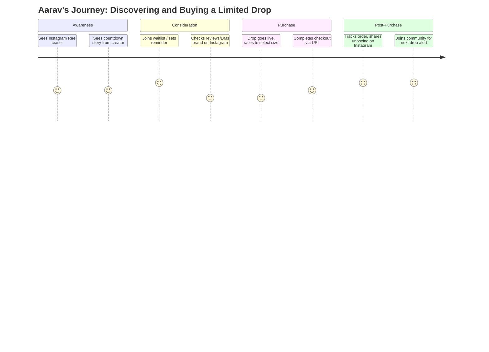
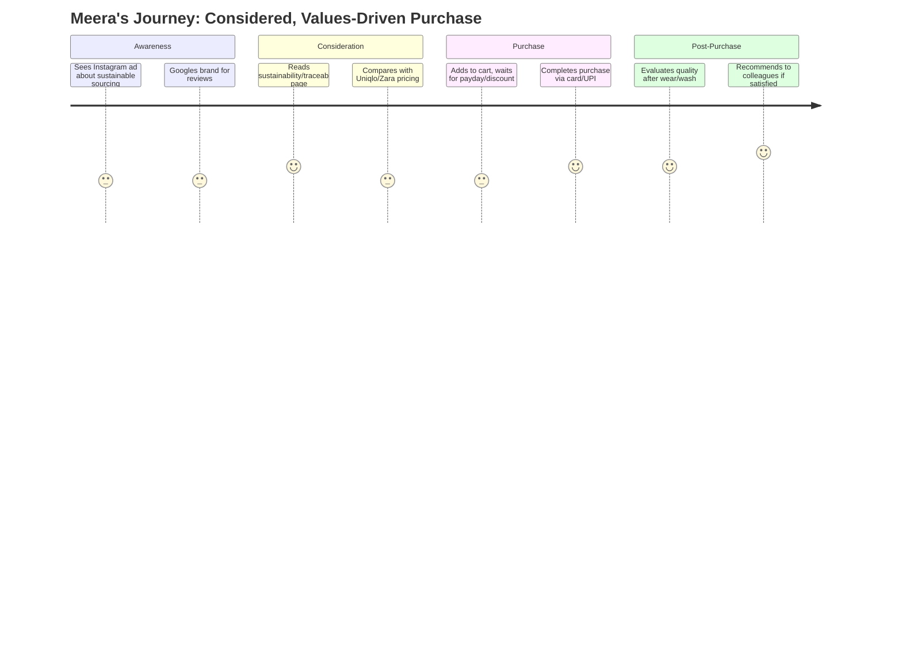

# Section 3 — Customer Research
### Jentara | Personas, Journeys, JTBD & Customer Insights

---

## 3.1 Target Audience Overview

Jentara's addressable audience is not "everyone who buys clothes" — it is defined narrowly around **identity-seeking, story-responsive buyers**, layered across four groups:

| Segment | Age | Description | Role in GTM |
|---|---|---|---|
| Gen-Z Trendsetters | 16–22 | College students, early creators, high social media activity | Primary acquisition + virality engine |
| Young Professionals | 23–29 | Early-career, higher disposable income, brand-conscious | Highest AOV, most repeat-purchase potential |
| Fashion Enthusiasts | 18–30 | Actively follow drops/collabs across multiple brands, collector mindset | Drives sell-through speed & resale buzz |
| Creators & Micro-Influencers | 18–28 | Fashion/mythology/gaming content creators | Marketing amplification + co-design partners |

## 3.2 User Personas

### Persona 1 — "Aarav, the Campus Trendsetter"

| Attribute | Detail |
|---|---|
| Age | 20 |
| Occupation | Engineering student, Tier-1 city |
| Income | Pocket money + occasional freelance gigs, ₹5,000–10,000/month spend budget |
| Devices | Mobile-first, Instagram + YouTube heavy user |
| Goals | Stand out on campus, be "first" to own a hyped drop, build a personal aesthetic |
| Frustrations | Can't afford luxury streetwear; hates generic fast-fashion prints; missed past drops due to sell-outs |
| Motivations | Social validation, storytelling behind the product, scarcity/FOMO |
| Quote | *"If I'm going to spend on a tee, it better mean something and nobody else should have it in three days."* |

### Persona 2 — "Meera, the Young Professional"

| Attribute | Detail |
|---|---|
| Age | 26 |
| Occupation | Product designer at a tech company |
| Income | ₹9–14 LPA, moderate-high discretionary spend |
| Devices | Mobile + desktop, shops during commute/evenings |
| Goals | Buy fewer, better pieces; support brands with values she agrees with (sustainability) |
| Frustrations | Fast fashion feels wasteful and low quality; few premium options that aren't Western/generic |
| Motivations | Quality, sustainability credibility, versatile design she can wear beyond one season |
| Quote | *"I'll pay more if I trust where it's made and know I won't see five other people wearing the exact same thing at work."* |

### Persona 3 — "Kabir, the Fashion Enthusiast / Collector"

| Attribute | Detail |
|---|---|
| Age | 24 |
| Occupation | Freelance graphic designer |
| Income | Variable, but allocates a fixed "fashion budget" monthly |
| Devices | Heavy app user, follows 30+ streetwear brands & resale marketplaces |
| Goals | Own rare/limited pieces, build a recognizable personal archive |
| Frustrations | Bots/resellers snapping up drops instantly; brands with no restock transparency |
| Motivations | Scarcity, drop mechanics, resale value, brand lore/story depth |
| Quote | *"I want the story of the piece as much as the piece itself — that's what makes it worth collecting."* |

### Persona 4 — "Naina, the Creator/Micro-Influencer"

| Attribute | Detail |
|---|---|
| Age | 22 |
| Occupation | Fashion + lifestyle content creator (40K Instagram followers) |
| Income | Brand collabs + freelance content, income-sensitive to engagement |
| Devices | Mobile-first, content creation tools heavy |
| Goals | Partner with authentic, visually distinctive brands; grow her own aesthetic credibility |
| Frustrations | Generic PR packages that don't fit her content niche; brands that don't credit/collab meaningfully |
| Motivations | Co-creation opportunities, affiliate/referral earnings, early access for content |
| Quote | *"I only work with brands whose story I'd actually tell even if they weren't paying me."* |

## 3.3 Customer Segments (Summary Table)

| Segment | Primary Need | Price Sensitivity | Channel Preference | Content That Converts |
|---|---|---|---|---|
| Campus Trendsetters | Identity + social proof | High | Instagram Reels, WhatsApp groups | Drop countdowns, unboxing reels |
| Young Professionals | Quality + values alignment | Medium | Instagram, Email, Google Search | Sustainability story, lookbooks |
| Fashion Enthusiasts/Collectors | Scarcity + lore | Low-Medium | Instagram, Discord/community, resale forums | Behind-the-scenes design story, restock alerts |
| Creators | Partnership + authenticity | N/A (barter/affiliate) | DM outreach, creator marketplaces | Collab briefs, affiliate dashboards |

## 3.4 Empathy Maps

### Empathy Map — Aarav (Campus Trendsetter)

| Says | Thinks |
|---|---|
| "This drop looks fire, I need it before it sells out" | "Will I actually get a size before it's gone?" |
| "This is so different from Bewakoof/Snitch" | "Is this brand legit or just another Instagram store?" |

| Does | Feels |
|---|---|
| Follows waitlist, sets reminders, checks Instagram Stories obsessively | Anxious about missing the drop; excited when it launches |

### Empathy Map — Meera (Young Professional)

| Says | Thinks |
|---|---|
| "I want to know where this is actually made" | "Is 'sustainable' just marketing here, or real?" |
| "I don't want to look like everyone else at work" | "Will this still feel relevant in 6 months?" |

| Does | Feels |
|---|---|
| Reads About/Sustainability pages before buying; checks reviews | Skeptical initially, reassured by transparency, proud after purchase |

## 3.5 Customer Journey Maps

### Journey Map — First-Time Drop Buyer (Aarav persona)

### Journey Map — Considered Purchase (Meera persona)

## 3.6 Jobs To Be Done (JTBD) Framework

| Job Type | Job Statement |
|---|---|
| Functional | "When I want to stand out on campus, I want apparel that no one else has, so I can express my individuality." |
| Emotional | "When I wear a Jentara piece, I want to feel connected to something meaningful (mythology/heritage), so I feel proud, not just dressed." |
| Social | "When I post an unboxing or outfit, I want it to signal that I'm 'in the know' on culturally distinctive drops, so my peers see me as a tastemaker." |
| Functional (Meera) | "When I choose what to buy, I want confidence that the sourcing is ethical, so I don't compromise my values for style." |

## 3.7 Pain Points (Consolidated)

| Pain Point | Segment Most Affected | Product Implication |
|---|---|---|
| Drops sell out before genuine fans can buy (bots/resellers) | Collectors, Trendsetters | Waitlist + queue system, per-account purchase limits |
| No trust in "sustainable" claims | Young Professionals | Dedicated, evidence-backed sustainability/traceability page |
| Fear of missing restocks | Trendsetters, Collectors | Restock notification system (email/WhatsApp/push) |
| Sizing uncertainty for streetwear fits | All segments | Size guide + AI styling assistant (Section 6) |
| Payment friction (failed UPI/card transactions) | All segments | Reliable Razorpay integration with multiple fallback methods (UPI, cards, netbanking, wallets) |
| Slow/unclear delivery and returns | All segments | Transparent SLAs, real-time order tracking (Section 14 — Operations) |

## 3.8 Sample User Interview Guide

**Objective:** Validate willingness to pay, drop-mechanics appeal, and sustainability credibility.

1. Walk me through the last piece of clothing you were genuinely excited to buy — what made it exciting?
2. Have you ever missed out on a "drop" or limited release? How did that feel, and what did you do next?
3. When a brand says it's "sustainable," what would make you actually believe that claim?
4. How do you currently decide on sizing when buying clothes online, especially from a new brand?
5. What would make you follow a new fashion brand's Instagram/waitlist *before* they even launch?
6. If your favorite creator collaborated with a brand, how would that change your likelihood to buy?
7. What's frustrated you about checkout/payment on fashion sites before?

## 3.9 Sample Survey Questions (Quantitative)

| # | Question | Type |
|---|---|---|
| 1 | How often do you purchase streetwear/fashion online per quarter? | Multiple choice |
| 2 | Rate how important "limited edition/scarcity" is to your purchase decision (1–5) | Likert scale |
| 3 | Rate how important "sustainability transparency" is to your purchase decision (1–5) | Likert scale |
| 4 | Which brands do you currently follow or purchase from? (select all) | Multi-select |
| 5 | What's the maximum you'd pay for a graphic tee you loved the story behind? | Numeric/range |
| 6 | Which payment method do you prefer for online fashion purchases? | Multiple choice (UPI/Card/Netbanking/Wallet/COD) |
| 7 | Would you join a waitlist for early access to a limited drop? | Yes/No |
| 8 | How likely are you to recommend a brand you love to friends? (NPS, 0–10) | NPS scale |

## 3.10 Customer Insights — Synthesis

1. **Scarcity is a feature, not a bug** — across personas, drop-based urgency increases desirability rather than causing frustration, *provided* the queueing/waitlist experience feels fair.
2. **Sustainability must be proven, not claimed** — Young Professionals in particular will disengage if sustainability messaging isn't backed by concrete sourcing detail.
3. **Payment reliability is a silent trust signal** — friction at checkout (especially UPI failures) is disproportionately damaging for first-time buyers who haven't yet built brand trust. This directly informs the Razorpay integration requirements in the PRD (Section 5) and Architecture (Section 7).
4. **Creators are a distribution channel, not just an ad medium** — Naina-type personas want co-creation and affiliate structures, not one-off paid posts.
5. **Community reduces price sensitivity** — Collector/Enthusiast segments show lower price sensitivity when part of an active community (Discord/Instagram Close Friends/waitlist groups) versus anonymous browsing.

---
**Previous section:** [`02-Market-Research`](../02-Market-Research/Market-Research.md)
**Next section:** [`04-Product-Strategy`](../04-Product-Strategy/Product-Strategy.md)
