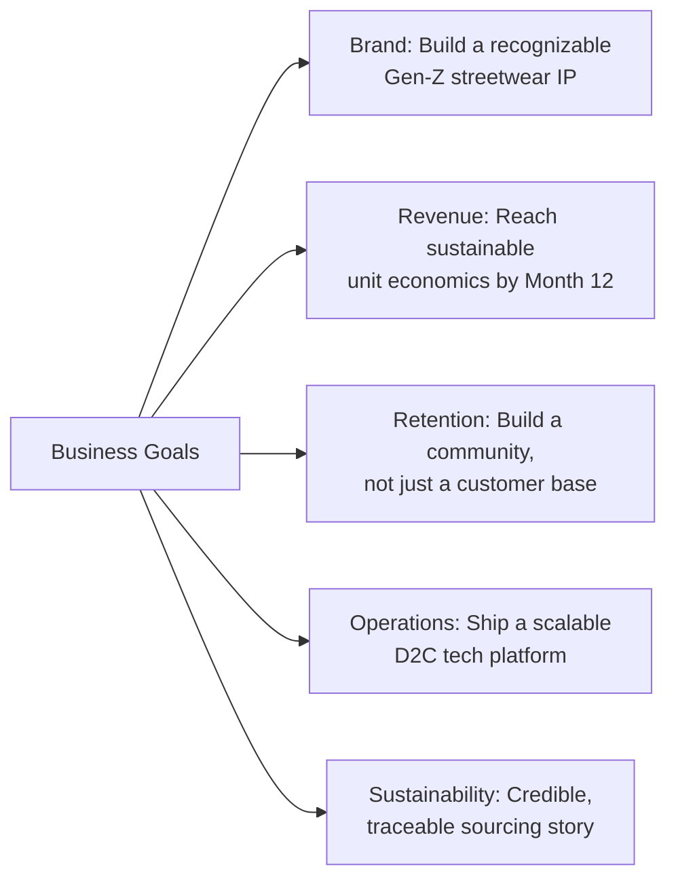
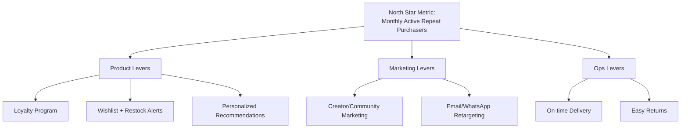

# Section 1 — Executive Summary
### Jentara | Premium Gen-Z Streetwear & Sustainable Fashion

---

## 1.1 Vision

> **"To become the most culturally resonant fashion-tech brand for Gen-Z in South Asia — where every drop tells a story rooted in Indian mythology, constellations, and futurism, and every purchase is a statement of identity, not just style."**

Jentara exists at the intersection of **narrative-driven fashion** and **sustainable D2C commerce**. The long-term vision is for Jentara to be recognized the way Supreme is recognized for drop culture, but with a distinctly Indian mythological and cosmic design language, and a sustainability backbone that Gen-Z consumers increasingly demand.

## 1.2 Mission

To design and deliver **limited-edition, story-first apparel** that lets young Indians express identity, heritage, and individuality — built on a technology platform fast enough, personal enough, and transparent enough to match Gen-Z's expectations of a digital-native brand.

## 1.3 Problem Statement

| Problem | Evidence / Rationale |
|---|---|
| Fashion e-commerce in India is saturated with generic fast-fashion catalogs (100s of SKUs, low emotional connection) | Bewakoof, Snitch, Souled Store compete mostly on price and volume, not narrative depth |
| Gen-Z wants **identity-driven** products, not just clothes | Global data (Depop, StockX resale culture) shows story + scarcity drive higher engagement than price |
| Sustainability is a stated Gen-Z priority but rarely operationalized honestly | Most "sustainable" claims in Indian D2C fashion are marketing labels without supply-chain transparency |
| Drop-based / limited-edition commerce is technically harder (inventory bursts, flash-traffic, waitlists) than always-on catalog commerce | Existing platforms (Shopify-based competitors) aren't optimized for hype-drop mechanics at India price points |
| No major Indian streetwear brand fuses **mythology + constellations + futurism** as a core design language | Whitespace confirmed via competitor catalog review (Section 2) |

## 1.4 Opportunity

- **Market size**: India's fashion e-commerce market is projected to keep growing at double-digit CAGR through the late 2020s, with athleisure/streetwear as one of the fastest-growing sub-segments.
- **Demographic tailwind**: India has one of the youngest populations globally; Gen-Z + young millennials represent a growing share of online discretionary spend.
- **Cultural tailwind**: Renewed mainstream interest in Indian mythology and heritage aesthetics (seen in gaming, film, and streetwear collabs) is currently underserved by premium apparel brands.
- **Business model tailwind**: D2C brands that combine storytelling + scarcity (limited drops) can command 20–40% higher average order values than always-on catalog brands, with stronger community/resale dynamics.
- **Technology tailwind**: Modern composable stacks (Next.js + Supabase + Razorpay + Vercel) let a small team ship an experience-grade storefront at a fraction of legacy platform cost — leveling the playing field against larger incumbents.

## 1.5 Business Goals

## 1.6 SMART Goals (Year 1)

| Goal | Specific | Measurable | Achievable | Relevant | Time-bound |
|---|---|---|---|---|---|
| Launch MVP storefront | Ship Next.js + Supabase storefront with checkout, wishlist, auth | Live in production | Yes, with lean team using chosen stack | Core to GTM | Within Q1 |
| First 3 limited drops | Launch 3 mythology/constellation-themed collections | 3 drops, ≥80% sell-through on drop 1 | Realistic with pre-launch waitlist marketing | Validates USP | By end of Q2 |
| Revenue milestone | Reach ₹50L cumulative GMV | GMV tracked in dashboard | Achievable with influencer-led launch | Core to business goal | By end of Year 1 |
| Retention milestone | 25% repeat purchase rate | Cohort repeat-purchase tracking | Achievable via loyalty + community | Core to LTV | By end of Year 1 |
| Community building | 25,000 Instagram + waitlist community members | Follower/waitlist count | Achievable with creator marketing | Supports GTM & retention | By end of Year 1 |
| Sustainability proof point | Publish supply-chain transparency report | Report published, 100% of drop-1 SKUs traced | Achievable with vetted vendor partners | Differentiator vs competitors | By end of Q3 |

## 1.7 Success Metrics & KPIs

| Category | Metric | Target (Year 1) |
|---|---|---|
| Acquisition | Website sessions/month | 150,000+ by Q4 |
| Acquisition | CAC | < ₹450 |
| Conversion | Conversion rate | ≥ 2.5% |
| Conversion | Cart abandonment rate | < 65% |
| Revenue | AOV | ≥ ₹2,200 |
| Revenue | Monthly Recurring Revenue (subscription/loyalty tier, if launched) | ₹2L+ by Q4 |
| Retention | Repeat purchase rate | ≥ 25% |
| Retention | LTV:CAC ratio | ≥ 3:1 |
| Product | Drop sell-through rate | ≥ 80% within 7 days |
| Brand | NPS | ≥ 50 |
| Ops | On-time fulfillment rate | ≥ 95% |

## 1.8 North Star Metric

> **Monthly Active Repeat Purchasers (MARP)** — the number of customers who make a second (or further) purchase within a rolling 90-day window.

**Why this metric:** Jentara's business model depends on converting one-time hype buyers into a returning community. Revenue and traffic can be bought; repeat purchase behavior signals genuine brand affinity and validates the storytelling + drop-culture thesis. Every team (Product, Design, Marketing, Ops) can influence MARP: Product via retention features (wishlist, loyalty, notifications), Marketing via community building, Ops via fulfillment reliability, Design via post-purchase experience.

---
**Next section:** [`02-Market-Research`](../02-Market-Research/Market-Research.md)
