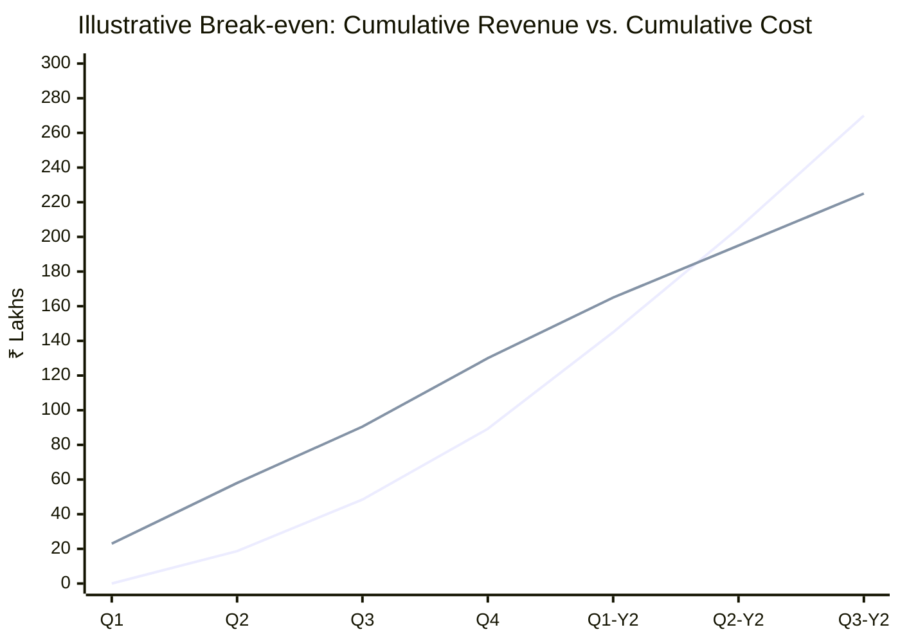
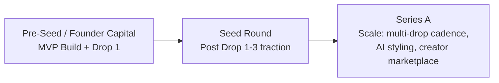

# Section 12 — Financial Planning
### Jentara | Revenue Model, Budget & Investor Summary

*Note: All figures below are illustrative planning estimates for case-study purposes, not audited financials. They are directionally consistent with Section 1 (SMART Goals) and Section 4 (Pricing Strategy).*

---

## 12.1 Revenue Streams

| Stream | Description | Year 1 Contribution (est.) |
|---|---|---|
| Direct Product Sales | Core apparel sales across Core/Premium/Limited tiers | ~90% |
| Loyalty Program (from Month 3) | Indirect revenue driver via repeat purchase uplift | Influences retention, not separately monetized in Y1 |
| Creator/Affiliate Marketplace (from Month 4) | Commission model — net-neutral to slightly positive (mostly a CAC-efficiency lever in Y1) | ~2–3% |
| Gift Cards (from Month 6) | Prepaid gifting revenue | ~5–7% |

## 12.2 Year 1 Budget (Illustrative, ₹ Lakhs)

| Category | Q1 | Q2 | Q3 | Q4 | Year 1 Total |
|---|---|---|---|---|---|
| Product/Manufacturing (COGS) | 8 | 14 | 12 | 16 | 50 |
| Technology & Hosting (Vercel, Supabase, Razorpay fees) | 1.5 | 1.5 | 2 | 2 | 7 |
| Marketing (Performance + Creator) | 4 | 8 | 7 | 9 | 28 |
| Logistics & Fulfillment | 2 | 4 | 4 | 5 | 15 |
| Team (Product/Eng/Design, lean core team) | 6 | 6 | 6 | 6 | 24 |
| Operations & Admin (office, tools, misc.) | 1.5 | 1.5 | 1.5 | 1.5 | 6 |
| **Total Spend** | **23** | **35** | **32.5** | **39.5** | **130** |

## 12.3 Revenue Projection (Illustrative, ₹ Lakhs)

| Quarter | GMV | Net Revenue (post returns/discounts, ~85% of GMV) |
|---|---|---|
| Q1 (Build phase, no sales) | 0 | 0 |
| Q2 (Drop 1 launch) | 22 | 18.7 |
| Q3 (Drop 2, retention ramp) | 35 | 29.75 |
| Q4 (Drop 3, scale) | 48 | 40.8 |
| **Year 1 Total** | **105** | **89.25** |

*(Note: This tracks toward the ₹50L cumulative GMV SMART goal from Section 1.6 as a conservative floor, with upside scenario shown here reaching ~₹105L GMV if Drop 1 sell-through and retention targets are hit.)*

## 12.4 Profit & Loss Snapshot (Year 1, Illustrative)

| Line Item | Amount (₹ Lakhs) |
|---|---|
| Net Revenue | 89.25 |
| COGS | 50 |
| **Gross Profit** | **39.25** |
| Gross Margin % | ~44% |
| Operating Expenses (Marketing, Tech, Logistics, Team, Admin) | 80 |
| **EBITDA (Year 1)** | **(40.75)** — planned pre-profitability investment year |

**Interpretation:** Year 1 is intentionally an investment/validation year (brand-building, MVP build, first three drops). Path to EBITDA breakeven is targeted around Month 18–20 as repeat purchase rate and AOV compound (see 12.6 Break-even Analysis).

## 12.5 Unit Economics

| Metric | Target | Rationale |
|---|---|---|
| AOV | ₹2,200 | Per Section 1.7 KPI target |
| Gross Margin per Order | ~44% | Product cost + logistics against realized price |
| CAC | < ₹450 | Blended across paid + creator/organic channels |
| LTV (12-month, at 25% repeat rate) | ~₹3,400 | AOV × avg. orders per repeat customer, weighted by repeat rate |
| LTV:CAC Ratio | ≥ 3:1 target (currently modeled ~3.2:1 at Year 1 exit run-rate) | Validates paid acquisition scaling into Year 2 |

## 12.6 Break-Even Analysis

**Reading:** The two lines represent cumulative net revenue vs. cumulative total cost. On this illustrative model, break-even (lines crossing) is projected around **Q2 of Year 2**, contingent on sustaining Year-1 exit-run-rate growth in repeat purchase rate and AOV.

## 12.7 ROI Considerations (For Investors)

| Input | Assumption |
|---|---|
| Estimated seed capital required | ₹1.5–2 Crore (covers Year 1 spend + working capital buffer) |
| Use of funds | ~40% inventory/manufacturing, ~25% marketing/launch, ~20% team, ~15% tech/ops |
| Payback horizon (on CAC) | Within 2 purchase cycles at modeled repeat rate |
| Key value inflection point | Post-Drop 3, once repeat-purchase cohort data validates LTV:CAC durability |

## 12.8 Funding Roadmap

| Stage | Timing | Purpose | Target Raise |
|---|---|---|---|
| Pre-Seed / Bootstrapped | Pre-launch | MVP build, Drop 1 inventory, initial marketing | ₹40–60L |
| Seed | Post Drop 1–3 (Month 6–9) | Scale inventory, marketing, team; validate retention | ₹1.5–2.5 Cr |
| Series A | Year 2, post-validated unit economics | International/creator marketplace/AI styling expansion | ₹8–15 Cr (indicative) |

## 12.9 Investor Pitch Summary

> **Jentara** is a premium Gen-Z streetwear D2C brand built around a defensible creative whitespace — mythology, constellations, and futurism — validated through a drop-based commerce model with genuine scarcity. Built on a lean, modern tech stack (Next.js, Supabase, Razorpay, Vercel), Jentara is engineered to launch fast and scale efficiently. The business targets a **3:1+ LTV:CAC ratio** and **25%+ repeat purchase rate** within Year 1, with a clear funding path from pre-seed validation through Series A-scale expansion into AI-personalized styling and a creator marketplace.

**Key investor-facing proof points to track post-launch:**
- Drop 1 sell-through rate (target ≥80% in 7 days)
- Cohort-based repeat purchase rate (target ≥25% within 90 days)
- CAC trend across paid vs. creator-led channels
- Gross margin stability as manufacturing scales

---
**Previous section:** [`11-Marketing`](../11-Marketing/Marketing.md)
**Next section:** [`13-Roadmap`](../13-Roadmap/Roadmap.md)
