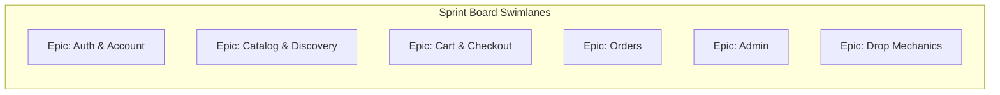

# Section 9 — Jira, Sprint Board & Workspace Templates
### Jentara | Ticketing, Boards & PM Tool Setup

---

## 9.1 Jira Project Setup

| Setting | Value |
|---|---|
| Project Key | `JNT` |
| Project Type | Scrum |
| Issue Types | Epic, Story, Task, Bug, Sub-task |
| Sprint Length | 2 weeks |
| Story Point Scale | Fibonacci (1, 2, 3, 5, 8, 13, 21) |
| Labels | `frontend`, `backend`, `razorpay`, `admin`, `drop-mechanics`, `design-system`, `security` |
| Components | Storefront, Admin, Payments, Auth, Notifications, Infra |

## 9.2 Sample Jira Tickets

### Epic: JNT-1 — Checkout & Payments

**JNT-14 | Story | Razorpay Checkout SDK Integration**
```
Type: Story
Epic Link: JNT-1 Checkout & Payments
Priority: Highest
Story Points: 5
Labels: frontend, razorpay
Component: Payments

Description:
As a shopper, I want to pay using UPI/Card/Netbanking/Wallet via Razorpay,
so that I can complete my purchase using my preferred payment method.

Acceptance Criteria:
- Razorpay Checkout SDK loads on the checkout page (lazy-loaded)
- User can select any Razorpay-supported payment method
- On success, frontend calls /api/checkout/verify with payment details
- On failure/cancellation, user sees a clear retry CTA
- Loading and error states match design system (Section 6.10.4)

Definition of Done:
- Code reviewed and merged to main
- Unit tests for verify-call trigger logic
- QA sign-off in staging with Razorpay test mode
- No console errors in production build
```

**JNT-15 | Task | Server-side Razorpay Signature Verification**
```
Type: Task
Epic Link: JNT-1 Checkout & Payments
Priority: Highest
Story Points: 3
Labels: backend, razorpay, security
Component: Payments

Description:
Implement HMAC-SHA256 signature verification for /api/checkout/verify
using the Razorpay key secret, per architecture spec (Section 7.2).

Acceptance Criteria:
- Signature mismatch returns 400 and does NOT confirm order
- Valid signature triggers order confirmation + inventory decrement
- Secret key read only from server-side environment variable
- Logged with correlation ID for observability

Definition of Done:
- Security review passed
- Test cases for valid/invalid/missing signature
```

**JNT-16 | Bug | Inventory hold not released on payment cancellation**
```
Type: Bug
Priority: High
Story Points: 2
Labels: backend, razorpay
Component: Payments

Steps to Reproduce:
1. Initiate checkout for a limited-drop item
2. Cancel Razorpay modal before completing payment
3. Observe inventory_holds table

Expected: Hold expires per TTL and stock becomes available again
Actual: Hold persists beyond TTL, blocking other buyers

Fix: Ensure expiry cron/edge job runs on schedule; add fallback
check at read-time in stock query.
```

### Epic: JNT-2 — Drop Mechanics

**JNT-22 | Story | Waiting Room for High-Traffic Drops**
```
Type: Story
Epic Link: JNT-2 Drop Mechanics
Priority: High
Story Points: 8
Labels: backend, frontend, drop-mechanics
Component: Storefront

Description:
As a shopper, I want a fair queueing experience when a drop's traffic
exceeds capacity, so that I'm not shown a broken/slow page.

Acceptance Criteria:
- Traffic above defined threshold routes users to waiting room
- Live queue position displayed and updates without full page reload
- Users auto-advance to drop page as capacity frees
- Waiting room respects prefers-reduced-motion for progress animation

Definition of Done:
- Load-tested at 15x baseline concurrent traffic
- QA sign-off
- Analytics event tracking for queue entry/exit times
```

## 9.3 Sample Sprint Board (Kanban View)

| Backlog | To Do | In Progress | In Review | QA | Done |
|---|---|---|---|---|---|
| JNT-30 Coupon engine | JNT-16 Fix hold-release bug | JNT-14 Razorpay SDK integration | JNT-13 Cart hold logic | JNT-11 Auth OTP flow | JNT-05 Design system tokens |
| JNT-31 Review moderation | JNT-22 Waiting room | JNT-15 Signature verification | | | JNT-06 Product schema |
| JNT-32 Gift cards (post-MVP) | | JNT-18 Admin inventory screen | | | JNT-07 PDP layout |

**WIP Limits:** In Progress: 5 · In Review: 3 · QA: 3 (enforced to prevent context-switching overload)

## 9.4 Board Swimlanes (by Epic)



## 9.5 Sample Notion Workspace Structure

```
Jentara Workspace (Notion)
├── 🏠 Home Dashboard (project status, quick links)
├── 📋 Product
│   ├── PRD (linked/embedded from this doc set)
│   ├── Roadmap (timeline view database)
│   ├── User Personas
│   └── Feedback Inbox (customer/UAT feedback log)
├── 🛠️ Engineering
│   ├── Architecture Docs
│   ├── API Reference
│   ├── Sprint Backlog (synced with Jira via integration)
│   └── Incident Log
├── 🎨 Design
│   ├── Design System Tokens
│   ├── Wireframes/Figma Embeds
│   └── Component Library Reference
├── 📈 Marketing
│   ├── Campaign Calendar
│   ├── Content Bank (drop lore, captions, creator briefs)
│   └── Influencer Tracker (database)
├── 💰 Finance
│   ├── Budget Tracker
│   └── Revenue Dashboard
└── 🗂️ PMO
    ├── Risk Register (database, linked to Section 8.8)
    ├── Meeting Notes (recurring templates)
    └── Decision Log
```

### Notion Database — Risk Register (Property Schema)

| Property | Type |
|---|---|
| Risk ID | Text (auto-formula: RSK-001...) |
| Description | Text |
| Likelihood | Select (Low/Medium/High) |
| Impact | Select (Low/Medium/High/Critical) |
| Owner | Person |
| Status | Select (Open/Mitigated/Closed) |
| Linked Sprint | Relation to Sprint DB |

## 9.6 Sample ClickUp Workspace Structure

```
Jentara Space (ClickUp)
├── Folder: Product & Engineering
│   ├── List: Backlog (all epics/stories, custom fields: Priority, Points, Component)
│   ├── List: Current Sprint (Board view: To Do/In Progress/Review/QA/Done)
│   ├── List: Bugs (Board view by Severity)
│   └── List: Release Checklist (Section 10 QA gates)
├── Folder: Design
│   └── List: Design System & Wireframe tasks
├── Folder: Marketing & Launch
│   ├── List: Campaign Calendar (Calendar view)
│   └── List: Creator Partnerships (Table view)
├── Folder: Operations
│   ├── List: Vendor/Manufacturing Tracker
│   └── List: Fulfillment SLAs
└── Dashboards
    ├── Sprint Velocity Dashboard
    ├── Burndown Chart
    └── Launch Readiness Dashboard (checklist rollup)
```

**ClickUp Custom Fields (Engineering List):** Story Points (number), Component (dropdown), Razorpay-related (checkbox), Security Review Required (checkbox), Environment (Local/Preview/Staging/Prod).

## 9.7 Definition of Ready / Definition of Done (Team Standard)

| Definition of Ready (before sprint pull-in) | Definition of Done (before marking complete) |
|---|---|
| Acceptance criteria written | Code reviewed & merged |
| Design/UX reference linked (if UI story) | Automated tests passing |
| Dependencies identified | QA verified in staging |
| Story sized by team | No P1/P2 bugs open against the story |
| No open blocking questions | Deployed to production (or ready for next release) |

---
**Previous section:** [`08-Agile`](../08-Agile/Agile.md)
**Next section:** [`10-PMO`](../10-PMO/PMO.md)
