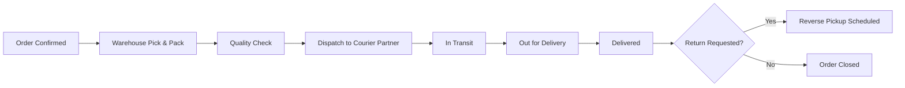

# Section 14 — Operations, Launch & Appendix
### Jentara | Fulfillment, Support, Glossary & Final Recommendations

---

## PART A — OPERATIONS

## 14.1 Inventory Management

| Practice | Detail |
|---|---|
| Drop-based production | Manufacture to a fixed limited quantity per SKU per drop — no continuous restocking mid-drop (preserves genuine scarcity, per Section 4.8 differentiation) |
| Buffer stock | Small reserve (~5%) held back from initial listing to cover exchanges/defect replacements without triggering "sold out" prematurely |
| Low-stock alerts | Admin dashboard flags SKUs below threshold (Section 5, FR-17) so ops can plan future drop sizing, not restock mid-drop |
| Demand signal capture | Waitlist sign-up volume per collection used as a leading indicator for next drop's production quantity |

## 14.2 Warehouse & Fulfillment



| Stage | SLA Target |
|---|---|
| Order confirmed → Dispatch | Within 48 hours (excluding pre-order/made-to-order limited pieces, which are flagged separately) |
| Dispatch → Delivery (metro) | 2–4 business days |
| Dispatch → Delivery (non-metro) | 4–7 business days |
| Return pickup scheduling | Within 48 hours of return request approval |
| Refund processing (post pickup confirmation) | 5–7 business days, refunded via original Razorpay payment method |

## 14.3 Shipping

| Element | Approach |
|---|---|
| Courier Partners | Multi-courier strategy (2–3 partners) to ensure pincode coverage and rate competitiveness |
| Packaging | Branded, unboxing-optimized packaging (ties to Section 11.12 offline/organic marketing value) |
| Tracking | Real-time tracking synced to Order Detail page (Section 6, Account → Orders) |
| COD | Evaluated as a Phase 2 addition; MVP launches with prepaid-only via Razorpay to reduce fraud/return-to-origin risk during initial drops |

## 14.4 Returns & Exchanges

| Policy Element | Detail |
|---|---|
| Return Window | 7 days from delivery for standard items |
| Limited/Collector Items | Case-by-case — clearly disclosed at PDP if a piece is final-sale due to extreme scarcity |
| Exchange Priority | Size exchanges prioritized over refunds where stock allows, to retain GMV |
| Refund Method | Original payment method via Razorpay refund API — no manual bank transfers |
| Quality Issues | Fast-tracked (no return shipping cost to customer) for defect/quality-related returns |

## 14.5 Vendor Management

| Practice | Detail |
|---|---|
| Vendor Vetting | All manufacturing vendors audited for labor practices and material sourcing before onboarding (supports Section 3/4 sustainability positioning) |
| Vendor Scorecards | Tracked on quality defect rate, on-time production delivery, and compliance renewal status |
| Diversification | Minimum two vendor relationships per core product category to reduce single-point-of-failure risk (ties to Risk Register R3, Section 8.8) |

## 14.6 Customer Support

| Channel | SLA |
|---|---|
| Email Support | First response within 12 hours |
| Instagram DM | First response within 6 hours (high-traffic channel for Gen-Z audience) |
| WhatsApp (Phase 2) | First response within 4 hours once live |
| Order/Payment Issues | Escalation path directly to Ops lead for Razorpay payment discrepancies |

## 14.7 Order Fulfillment SLA Summary Table

| Metric | Target |
|---|---|
| On-time dispatch rate | ≥ 95% |
| On-time delivery rate | ≥ 90% |
| Return processing within SLA | ≥ 95% |
| Customer support first-response SLA adherence | ≥ 95% |
| Order accuracy (correct item/size shipped) | ≥ 98% |

---

## PART B — APPENDIX

## 14.8 Glossary

| Term | Definition |
|---|---|
| Drop | A scheduled, time-boxed release of a limited-quantity collection |
| GMV | Gross Merchandise Value — total value of goods sold before deductions |
| AOV | Average Order Value |
| CAC | Customer Acquisition Cost |
| LTV | Customer Lifetime Value |
| MARP | Monthly Active Repeat Purchasers (Jentara's North Star Metric) |
| Sell-through Rate | Percentage of available drop inventory sold within a defined period |
| RLS | Row-Level Security (PostgreSQL/Supabase data access control) |
| MoSCoW | Prioritization framework: Must/Should/Could/Won't have |
| RACI | Responsible, Accountable, Consulted, Informed — role clarity framework |
| ISR | Incremental Static Regeneration (Next.js rendering strategy) |
| HMAC | Hash-based Message Authentication Code (used for Razorpay signature verification) |

## 14.9 Meeting Notes Template

```
Meeting: [Sprint Review / Stakeholder Sync / Retro]
Date:
Attendees:
Agenda:
1.
2.
Decisions Made:
-
Action Items:
- [Owner] [Task] [Due Date]
Next Meeting:
```

## 14.10 Decision Log (Template + Sample Entries)

| Date | Decision | Rationale | Owner |
|---|---|---|---|
| Sample | Chose Razorpay over Stripe for payments | India-first UPI/netbanking/wallet support, better local checkout conversion | Founder/Eng Lead |
| Sample | MVP launches prepaid-only (no COD) | Reduce fraud/RTO risk on first three limited drops while trust is unproven | Product Owner |
| Sample | Mobile-web (not native app) for MVP | Faster time-to-market, app justified only once repeat-usage data supports it | Product Owner/Eng Lead |
| *(ongoing template row)* | | | |

## 14.11 OKRs (Sample — Quarter Aligned to Drop 1 Launch)

**Objective: Successfully launch Jentara's MVP and validate the drop-based commerce model**

| Key Result | Target |
|---|---|
| KR1: Ship production-ready MVP | Live by launch date, all Must-have PRD scope complete |
| KR2: Achieve strong Drop 1 sell-through | ≥ 80% within 7 days |
| KR3: Maintain payment reliability | Checkout success rate ≥ 98% |
| KR4: Build a pre-launch community | ≥ 5,000 waitlist sign-ups before Drop 1 |
| KR5: Validate retention thesis | ≥ 25% repeat purchase rate within 90 days of Drop 1 |

## 14.12 Final Recommendations

1. **Protect the scarcity mechanic operationally, not just in marketing copy.** The entire brand thesis depends on drops genuinely selling out — over-producing to "not disappoint" customers would undermine the core positioning (Section 4.6).
2. **Treat sustainability claims as a compliance-grade commitment, not a tagline.** Publish the vendor traceability report (Section 1.6 SMART goal) before scaling sustainability messaging in performance marketing.
3. **Invest disproportionately in checkout reliability.** Given the drop-day traffic pattern, Razorpay integration robustness and the waiting-room/inventory-hold system (Section 7) are higher-leverage engineering investments than incremental UI polish.
4. **Let creator relationships be the primary growth engine, not paid media alone**, given the CAC efficiency and authenticity advantages evidenced in Section 3 (Naina persona) and Section 11.
5. **Re-evaluate app/COD/WhatsApp investments only after Drop 1–3 data**, not on assumption — the roadmap (Section 13) intentionally sequences these behind real usage evidence.
6. **Keep MVP scope discipline.** The MoSCoW-prioritized backlog (Section 5.8) exists precisely to prevent AI styling, virtual try-on, and marketplace ambitions from delaying the core drop-commerce validation loop.

## 14.13 Lessons Learned (Template — to populate post-launch)

| Category | What Happened | What We'd Do Differently | Applies To Future Drops? |
|---|---|---|---|
| *(populate after Drop 1)* | | | |
| *(populate after Drop 1)* | | | |

---

## Document Set Complete

This concludes the 14-section Jentara Product Management Case Study. All sections (1–14) are now complete and cross-referenced.

**Suggested next steps for the team:**
- Circulate Sections 1, 2, 4, and 12 to founders/investors for strategic sign-off.
- Hand Sections 5, 7, 8, and 9 to engineering for sprint kickoff.
- Hand Section 6 to design for Figma production.
- Hand Section 11 to marketing for pre-launch campaign build-out.
- Use Section 10's Go/No-Go checklist as the literal launch gate.

**Previous section:** [`13-Roadmap`](../13-Roadmap/Roadmap.md)
**Back to index:** [`README`](../README.md)
