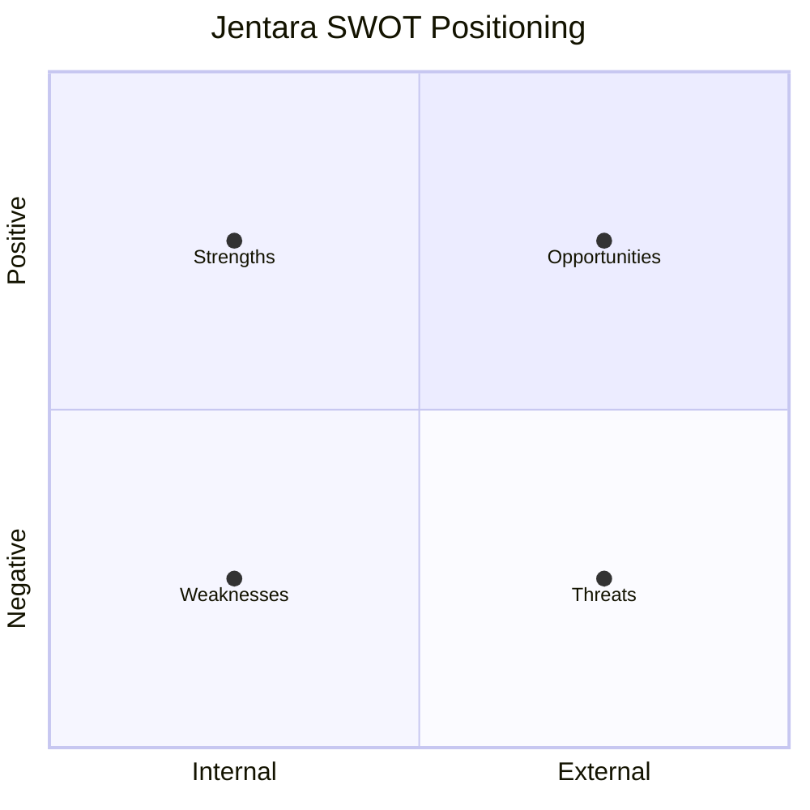
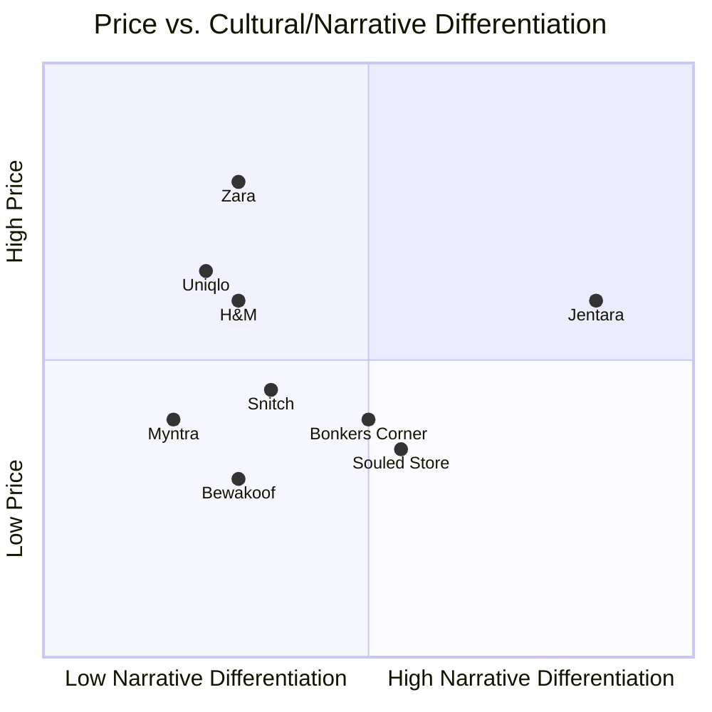

# Section 2 — Market Research
### Jentara | Industry, Competitive & Environmental Analysis

---

## 2.1 Industry Analysis

India's apparel e-commerce market sits within a broader D2C boom driven by rising smartphone penetration, UPI-based payments, and a young population with growing discretionary spend. Within apparel, **streetwear and athleisure** are among the fastest-growing sub-categories, outpacing traditional formal-wear and generic fast fashion. Premiumization is a parallel trend: consumers increasingly pay more for limited editions, collaborations, and brand storytelling rather than basic commodity clothing.

Key structural shifts relevant to Jentara:

- **From catalog to drop culture** — younger consumers respond to scarcity and hype mechanics (limited drops, waitlists, countdowns) more than infinite-scroll catalogs.
- **From influencer ads to creator communities** — brand trust increasingly comes from creator collaborations and community participation, not traditional advertising.
- **From "sustainable" as marketing copy to "traceable" as a real requirement** — a growing (though still minority) segment of Gen-Z actively checks sourcing claims.
- **From desktop-first to mobile-first, app-like web** — most fashion e-commerce traffic in India is mobile web/app; performance and Core Web Vitals materially affect conversion.

## 2.2 Fashion E-commerce Trends (Relevant to Jentara)

| Trend | Implication for Jentara |
|---|---|
| Drop-based limited releases | Requires platform support for waitlists, countdowns, flash-traffic handling |
| Resale / secondary market culture | Design for collectibility; consider verified-resale or authentication features later |
| AI styling & virtual try-on | Roadmap feature (Section 6/13) — differentiator vs. legacy competitors |
| Short-form video commerce (Instagram Reels/YouTube Shorts) | Core acquisition channel; content needs to be story-first, not product-first |
| Sustainability transparency | Opportunity for genuine differentiation if backed by real vendor audits |
| Loyalty-as-community (not just points) | Loyalty program should unlock early drop access, not just discounts |
| BNPL & flexible payments | Stripe + India payment partners should support popular BNPL/UPI flows |

## 2.3 SWOT Analysis

| Strengths | Weaknesses |
|---|---|
| Distinctive design language (mythology + constellations + futurism) — no direct Indian competitor owns this space | New brand, zero existing brand equity or customer trust |
| Modern, low-cost, high-performance tech stack (Next.js/Supabase/Vercel) | Limited initial capital vs. established players (Myntra, Uniqlo) |
| Drop-based model creates natural scarcity/marketing hooks | Drop-based model is riskier — poor sell-through is highly visible |
| Founder-led storytelling can build authentic community | Supply chain/sustainability claims need real vendor vetting — takes time |
| Lean team can iterate quickly | Limited initial catalog breadth vs. Myntra/Uniqlo |

| Opportunities | Threats |
|---|---|
| Underserved niche: heritage-meets-futurism aesthetic | Fast fashion giants (H&M, Zara, Uniqlo) can copy visual trends quickly at lower price |
| Creator economy partnerships (fashion, gaming, mythology-content creators) | Established D2C players (Bewakoof, Souled Store) have large existing audiences |
| International NRI/diaspora market interested in Indian-rooted design | Marketplace giants (Myntra) offer convenience (returns, COD, trust) hard to match early on |
| Resale/collector culture could extend brand lifetime value | Supply chain disruptions/cost inflation on sustainable materials |
| Data-driven personalization (AI styling) as a loyalty driver | Ad cost inflation on Meta/Google reduces paid acquisition efficiency |

## 2.4 PESTLE Analysis

| Factor | Analysis |
|---|---|
| **Political** | Government "Make in India" and textile-sector incentives support domestic manufacturing; GST structure affects apparel pricing tiers (below/above ₹1,000 threshold historically relevant to tax slabs). |
| **Economic** | Rising disposable income among urban Gen-Z/young professionals; inflation and value-consciousness mean pricing must be premium-but-justified, not luxury. |
| **Social** | Strong cultural pride resurgence (mythology, regional identity in pop culture); Gen-Z prioritizes self-expression and social proof (Instagram-worthy packaging/products). |
| **Technological** | Mobile-first commerce, UPI ubiquity, AI-driven personalization becoming standard expectation; composable commerce stacks lower the cost of building premium experiences. |
| **Legal** | Consumer protection e-commerce rules (return/refund disclosure), data protection compliance (India's DPDP Act) for customer data handled via Supabase; textile labeling regulations. |
| **Environmental** | Growing scrutiny of fast-fashion waste; genuine opportunity for a brand built around limited runs (inherently lower overproduction) and traceable materials. |

## 2.5 Porter's Five Forces

| Force | Intensity | Rationale |
|---|---|---|
| **Threat of New Entrants** | Medium-High | Low barrier to launching a D2C storefront (Shopify, Next.js templates); barrier is brand-building and supply chain, not technology |
| **Bargaining Power of Suppliers** | Medium | Sustainable/ethical manufacturers are fewer in number and can command premiums; diversifying vendors mitigates this |
| **Bargaining Power of Buyers** | High | Consumers have near-infinite alternatives (Myntra alone lists 1000s of brands); switching cost is near zero |
| **Threat of Substitutes** | High | Fast fashion, thrifted/resale fashion, and international brands (via Myntra Global, cross-border shopping) all substitute directly |
| **Competitive Rivalry** | High | Crowded Indian streetwear D2C space (Snitch, Bewakoof, Souled Store) plus global fast fashion (H&M, Zara, Uniqlo) |

**Strategic takeaway:** Jentara cannot win on price or convenience against Myntra/Uniqlo. It must win on **narrative differentiation, scarcity mechanics, and community loyalty** — the forces where a focused challenger brand can outperform incumbents.

## 2.6 Competitor Analysis

| Brand | Pricing (avg.) | Business Model | UX Highlights | Tech Stack (observed) | Marketing Approach | Strengths | Weaknesses | Opportunity for Jentara |
|---|---|---|---|---|---|---|---|---|
| **Myntra** | ₹500–₹3,000 | Marketplace + owned brands | Mature app, strong filters, easy returns | Custom enterprise stack | Mass performance marketing, sales events (EORS) | Massive selection, trust, logistics | Generic, low emotional brand connection per-SKU | Win on curated story-first drops vs. Myntra's catalog scale |
| **Snitch** | ₹900–₹2,500 | D2C, catalog + frequent new arrivals | Clean, fast site, strong Instagram funnel | Shopify-based (typical) | Heavy influencer + performance ads | Strong men's fastfashion-streetwear brand recall | Broad catalog, not narrative/scarcity driven | Differentiate via mythology/constellation storytelling & limited drops |
| **Bonkers Corner** | ₹800–₹2,000 | D2C, graphic tees/streetwear | Bold graphic-led product pages | Shopify-based | Meme/pop-culture marketing, collabs | Strong graphic-tee identity, collab culture | Print/graphic focus can feel trend-chasing vs. timeless | Position Jentara as "cultural heritage," more premium and durable than meme fashion |
| **Souled Store** | ₹700–₹1,800 | D2C, licensed pop-culture merch | Franchise/fandom-driven catalog browsing | Custom + Shopify hybrid (observed) | Licensed IP (Marvel, HP, anime) marketing | Strong fandom loyalty via licensed IP | Dependent on third-party IP licensing costs/limits | Jentara owns its IP/story fully — no licensing dependency or royalty costs |
| **Bewakoof** | ₹600–₹1,800 | D2C, mass streetwear/graphic tees | High-volume catalog, frequent sales | Custom stack, high scale | Broad digital + offline retail marketing | Large scale, strong brand recall, wide distribution | Volume-first positioning, price-led perception | Win on premium positioning, not competing on discount depth |
| **Uniqlo** | ₹1,200–₹4,000 | Global retail + D2C, basics-first | World-class UX, minimal, fast | Enterprise custom platform | Brand-led global marketing, minimal discounting | Quality basics, global trust, supply chain scale | Not driven by cultural storytelling or scarcity/hype mechanics | Jentara wins Gen-Z audience seeking identity-expression, not basics |
| **H&M** | ₹800–₹3,500 | Global fast fashion, high SKU turnover | Broad catalog, trend-cycle speed | Enterprise custom platform | Trend-driven mass marketing, sustainability sub-lines | Trend speed, global scale, broad price range | Fast-fashion sustainability criticism, generic design | Jentara's genuine limited-run model is inherently lower-waste vs. H&M's volume model |
| **Zara** | ₹1,500–₹5,000 | Global fast fashion, premium-fast | Editorial-style UX, minimal but premium feel | Enterprise custom platform | Editorial/aspirational marketing, no heavy discounting | Premium fast-fashion trust, strong visual merchandising | Not culturally rooted for Indian Gen-Z identity; higher price point | Jentara offers similar premium *feel* at accessible price with cultural relevance Zara lacks |

### 2.6.1 Positioning Map

**Reading the map:** Jentara is positioned as the brand with the *highest narrative/cultural differentiation* at a *mid-to-premium* (not luxury) price point — a whitespace no current competitor occupies.

## 2.7 Key Research Conclusions

1. No direct competitor combines **Indian mythology + constellations + futurism** as a core, owned design language — this is Jentara's clearest whitespace.
2. Competing on price or catalog breadth against Myntra/Bewakoof/Uniqlo is not viable for a new entrant — Jentara must compete on **story, scarcity, and community**.
3. Sustainability is a real differentiator **only if operationalized with genuine vendor traceability** — a "sustainability" label alone is not credible in this market.
4. Drop-based commerce is a proven model (global streetwear) but places heavy demands on **technical readiness for traffic spikes and inventory-burst handling** — a key input into Section 7 (Architecture).

---
**Previous section:** [`01-Executive-Summary`](../01-Executive-Summary/Executive-Summary.md)
**Next section:** [`03-Customer-Research`](../03-Customer-Research/Customer-Research.md)
