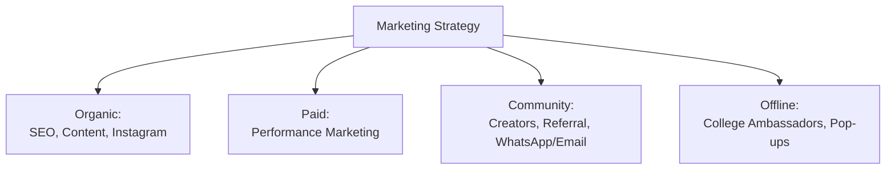
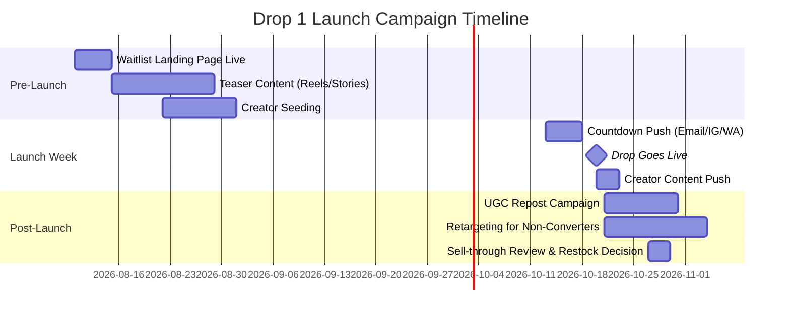

# Section 11 — Marketing
### Jentara | Growth, Content & Launch Strategy

---

## 11.1 Marketing Strategy Overview



## 11.2 SEO Strategy

| Focus Area | Approach |
|---|---|
| Technical SEO | Next.js SSR/ISR ensures crawlable, fast-loading pages; structured data (Product, Offer, Review schema) on PDPs |
| Keyword Strategy | Target long-tail, intent-rich terms: "mythology streetwear India," "constellation graphic tees," "sustainable Gen-Z fashion brand" |
| Content SEO | Blog/story content around Indian mythology, constellations, sustainable fashion — supports both discovery and brand storytelling |
| Link Building | Creator collabs and press features (fashion blogs, sustainability publications) as natural backlink sources |
| On-Page | Unique meta titles/descriptions per collection/PDP; alt text enforced via CMS (ties to Section 6.8 accessibility requirement) |

## 11.3 Content Marketing

| Content Pillar | Format | Purpose |
|---|---|---|
| Collection Lore | Blog posts, Instagram carousels | Deepen story-first positioning, support SEO |
| Sustainability Journey | Long-form articles, vendor spotlight videos | Build credibility (ties to Section 3 pain point on trust) |
| Styling Guides | Reels, lookbooks | Drive PDP traffic, reduce sizing/styling uncertainty |
| Behind-the-Design | Founder/designer video content | Humanize brand, build community connection |

## 11.4 Performance Marketing

| Channel | Objective | Notes |
|---|---|---|
| Meta Ads (Instagram/Facebook) | Primary acquisition channel for Trendsetter/Young Professional segments | Retarget waitlist visitors who didn't convert |
| Google Search Ads | Capture high-intent branded + category search | Budget-light; branded defense + "streetwear India" category terms |
| YouTube Shorts / Influencer Ads | Awareness + consideration | Sponsored creator content, boosted post-launch |
| Retargeting | Cart abandoners, PDP viewers who didn't purchase | Email + Meta retargeting sequences |

**Budget allocation guidance (indicative, refine in Section 12 — Finance):** 50% Meta, 20% creator/influencer, 15% Google, 15% retargeting/CRM tooling.

## 11.5 Instagram Strategy

| Element | Approach |
|---|---|
| Grid Aesthetic | Cinematic, mythology/cosmic art direction — consistent visual identity, not stock catalog imagery |
| Reels Cadence | 4–5x/week: drop teasers, styling, behind-the-scenes, UGC reposts |
| Stories | Daily — countdowns, polls (design/collab input), restock alerts |
| Close Friends / Broadcast Channel | Reserved for loyalty-tier and top-engaged followers — early access drops |
| Bio/Link-in-bio | Direct to active drop landing page or waitlist during pre-launch |

## 11.6 Creator Marketing & Influencer Campaigns

| Tier | Profile | Engagement Model |
|---|---|---|
| Macro Creators (100K+) | Fashion/lifestyle creators for awareness | Paid collab + affiliate code |
| Micro Creators (10K–100K) | Niche fashion/mythology/gaming creators | Gifted product + affiliate commission (Section 4.11) |
| Nano Creators / Community (1K–10K) | Authentic peer-level reach, campus-adjacent | UGC challenges, referral incentives |

**Sample Influencer Campaign Brief (Drop 1 Launch):**
```
Campaign: "Jentara Drop 1 — Written in the Stars"
Objective: Drive awareness + waitlist conversion pre-launch
Deliverables: 1 Reel (unboxing/styling), 2 Stories, 1 static grid post
Messaging: Focus on collection lore (constellation theme), NOT generic
product placement — creators briefed to share the story, not just the item
Tracking: Unique affiliate code + UTM-tagged link per creator
Timing: T-10 days to T-0 (launch day) of Drop 1
```

## 11.7 Email Marketing

| Flow | Trigger | Purpose |
|---|---|---|
| Welcome Series | Waitlist signup | Introduce brand story, set drop expectations |
| Drop Countdown | T-48h, T-2h before drop | Build urgency, drive return visits |
| Cart Abandonment | Cart inactive 1hr+ | Recover lost sales |
| Post-Purchase | Order confirmed | Thank you + care instructions + UGC prompt |
| Restock Alert | Wishlisted item restocked | Drive repeat visits |
| Win-back | No purchase in 60+ days | Re-engagement offer |

## 11.8 WhatsApp Marketing

| Use Case | Detail |
|---|---|
| Order Updates | Shipping/delivery status via WhatsApp Business API (post-MVP; email-first at MVP per Section 5.2 scope) |
| Drop Alerts | Opt-in broadcast list for instant drop-live notifications — high open-rate channel for India audience |
| Support | WhatsApp as an additional customer support channel alongside email |

## 11.9 Referral Campaign

Detailed mechanics defined in Section 4.11 (Referral Strategy). Marketing execution notes:
- Referral CTA placed in post-purchase email and order confirmation page.
- Leaderboard-style recognition for top referrers during Drop 1 (gamification, ties to Collector persona motivations from Section 3).

## 11.10 Launch Campaign Plan (Drop 1)



| Phase | Goal | Primary Channels |
|---|---|---|
| Pre-Launch (Weeks 1–6) | Build 5,000+ waitlist sign-ups | Instagram, creator seeding, landing page |
| Launch Week | ≥80% sell-through in 7 days | Email, Instagram, WhatsApp, creator content |
| Post-Launch | Convert traffic that didn't purchase; capture UGC | Retargeting, email win-back, UGC reposts |

## 11.11 Brand Partnerships

| Partnership Type | Example Direction |
|---|---|
| Cultural/Heritage Institutions | Collaborations with mythology-focused artists/illustrators for design collabs |
| Sustainability Certifiers | Partner with recognized ethical-sourcing auditors to back traceability claims |
| Creator-Brand Co-Design | Limited capsule collections co-designed with aligned creators (extends affiliate relationship into product) |

## 11.12 Offline Marketing

| Tactic | Detail |
|---|---|
| Pop-up Activations | Limited-time pop-ups in Tier-1 city creative/college hubs during major drops |
| Campus Events | Presence at college fests aligned with target demographic |
| Packaging as Marketing | Unboxing-optimized packaging designed for organic social sharing |

## 11.13 College Ambassador Program

| Element | Detail |
|---|---|
| Structure | 1–2 ambassadors per target campus, recruited from Trendsetter-persona-fit students |
| Incentives | Free product per drop + affiliate commission + exclusive ambassador-only merch |
| Responsibilities | Host micro-events/photo ops, share content, gather peer feedback on fit/sizing |
| Tracking | Dedicated referral codes per ambassador, tracked in the same affiliate system as creators (Section 9.6 ClickUp "Creator Partnerships" list) |

---
**Previous section:** [`10-PMO`](../10-PMO/PMO.md)
**Next section:** [`12-Finance`](../12-Finance/Finance.md)
