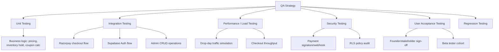

# Section 10 — Quality Assurance
### Jentara | Testing Strategy, Bug Tracking & Release Readiness

---

## 10.1 Testing Strategy Overview



**Testing Philosophy:** Given Jentara's model depends on drop-day traffic spikes and real-money transactions, QA weight is deliberately skewed toward **integration testing of the payment/inventory path** and **performance testing under burst load**, rather than broad UI test coverage alone.

## 10.2 Unit Testing

| Area | Coverage Target | Example Test Cases |
|---|---|---|
| Pricing/discount calculation | ≥90% | Coupon percentage vs. flat discount, stacking rules, min-order thresholds |
| Inventory hold logic | ≥90% | Hold creation, TTL expiry, release-on-cancel, oversell prevention |
| Razorpay signature verification | 100% | Valid signature, invalid signature, missing fields, replay attempt |
| Order state machine | ≥90% | Valid transitions (Pending→Confirmed→Shipped→Delivered), invalid transitions blocked |
| Cart/wishlist logic | ≥80% | Add/remove/update quantity, out-of-stock variant handling |

**Tooling:** Vitest/Jest for Node.js/TypeScript unit tests; React Testing Library for component logic.

## 10.3 Integration Testing

| Flow | Test Scope |
|---|---|
| Razorpay Checkout (end-to-end, test mode) | Order creation → SDK payment → webhook receipt → order confirmation → inventory decrement |
| Supabase Auth | OTP request/verify, session persistence, RLS enforcement across roles |
| Admin product/inventory sync | Admin edits reflected correctly in storefront within cache/ISR revalidation window |
| Notification pipeline | Order confirmation and restock alert emails triggered correctly and deliverably |
| Waitlist → Drop live transition | Waitlisted users receive notification at correct scheduled time |

**Tooling:** Playwright/Cypress for end-to-end flows against a staging environment with Razorpay test mode credentials.

## 10.4 Performance Testing

| Test | Method | Target |
|---|---|---|
| Drop-day traffic simulation | Load test at 10–15x baseline concurrent users hitting drop landing page + checkout-initiate | No degradation beyond NFR-04 (Section 5.4) |
| Checkout throughput | Simulate concurrent checkout-initiate requests for same limited SKU | Zero oversells; correct waiting-room activation at threshold |
| Page performance (Core Web Vitals) | Lighthouse/WebPageTest on PDP, home, checkout | LCP < 2.5s, CLS < 0.1, INP < 200ms |
| Database query performance | Query profiling on `product_variants`, `orders`, `inventory_holds` under load | No query > 200ms at p95 under simulated peak load |

## 10.5 Security Testing

| Test | Scope |
|---|---|
| Razorpay webhook signature spoofing attempt | Confirm unsigned/malformed webhook payloads are rejected |
| RLS policy audit | Verify a user cannot read/update another user's orders, addresses, or cart via direct API manipulation |
| Admin route access control | Confirm non-admin authenticated users cannot reach `/api/admin/*` endpoints |
| Rate limiting validation | Confirm checkout-initiate and auth endpoints throttle abusive request patterns |
| Dependency vulnerability scan | Automated scan (e.g., `npm audit` / Snyk) in CI pipeline before each release |

## 10.6 User Acceptance Testing (UAT)

| Step | Detail |
|---|---|
| Participants | Founders, Product Owner, 15–20 invited beta testers (mix of Trendsetter/Young Professional personas) |
| Environment | Staging, Razorpay test mode with real UPI test flows |
| Scope | Full purchase journey: waitlist → drop live → browse → checkout → order tracking → return request |
| Feedback Capture | Structured UAT feedback form (bugs, friction points, usability notes) logged into Notion Feedback Inbox (Section 9.5) |
| Exit Criteria | Zero critical/high-severity bugs open; ≥90% of UAT participants successfully complete a full purchase without assistance |

## 10.7 Bug Tracking & Severity Classification

| Severity | Definition | Example | SLA to Fix |
|---|---|---|---|
| P0 — Critical | Blocks core purchase flow or causes data/financial loss | Payment confirmed but order not created; oversell during drop | Immediate, before release |
| P1 — High | Major feature broken, workaround difficult | Waiting room fails to release users after drop capacity frees | Within 24 hours |
| P2 — Medium | Feature partially broken, workaround exists | Coupon code UI doesn't show error message clearly | Within current sprint |
| P3 — Low | Cosmetic/minor UX issue | Minor spacing inconsistency on mobile footer | Backlog, next sprint+ |

**Bug Report Template:**
```
Title:
Severity: P0 / P1 / P2 / P3
Environment: Local / Staging / Production
Steps to Reproduce:
Expected Result:
Actual Result:
Screenshots/Logs:
Linked Story/Epic:
```

## 10.8 Regression Testing

- Full regression suite (automated E2E) run on every release candidate build before production deployment.
- Critical-path regression subset (auth, checkout, order status) run on every merge to `main` via CI.
- Manual exploratory regression pass performed by QA before each major release (V1.0, V1.1, etc.).

## 10.9 Release Checklist (Go/No-Go Gate)

| # | Checklist Item | Status |
|---|---|---|
| 1 | All P0/P1 bugs resolved | ☐ |
| 2 | Automated test suite passing in CI (unit + integration) | ☐ |
| 3 | Load test completed at 15x baseline, results within NFR targets | ☐ |
| 4 | Security review + dependency scan completed | ☐ |
| 5 | Razorpay live-mode credentials configured and verified in production env | ☐ |
| 6 | Webhook endpoint verified reachable and signature-validated in production | ☐ |
| 7 | RLS policies reviewed and confirmed on all customer-data tables | ☐ |
| 8 | UAT sign-off obtained from Product Owner and Founders | ☐ |
| 9 | Rollback plan documented and tested (previous stable Vercel deployment pinned) | ☐ |
| 10 | Monitoring/alerting configured (error tracking, uptime, payment failure alerts) | ☐ |
| 11 | Drop 1 content (products, imagery, lore, pricing) uploaded and verified in production | ☐ |
| 12 | Customer support/FAQ content live and support team briefed | ☐ |

**Go/No-Go Decision Owner:** Founder (Accountable per RACI, Section 8.12), informed by Eng Lead and Product Owner recommendation.

---
**Previous section:** [`09-Jira`](../09-Jira/Jira-Templates.md)
**Next section:** [`11-Marketing`](../11-Marketing/Marketing.md)
