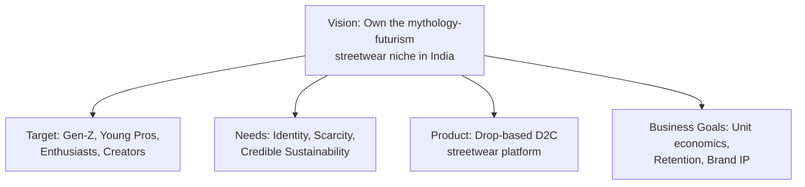

# Section 4 — Product Strategy
### Jentara | Canvases, Positioning, Pricing & Growth Levers

---

## 4.1 Vision Board

| Element | Detail |
|---|---|
| **Vision** | Become the defining Gen-Z streetwear IP fusing Indian mythology, constellations, and futurism |
| **Target Group** | Gen-Z + young professionals, fashion enthusiasts, creators (India-first, diaspora-second) |
| **Needs** | Identity expression, scarcity/story-driven purchases, credible sustainability |
| **Product** | Limited-edition drop-based streetwear D2C platform |
| **Business Goals** | Sustainable unit economics by Month 12, 25% repeat purchase rate, recognizable brand IP |



## 4.2 Value Proposition Canvas

### Customer Profile

| Customer Jobs | Pains | Gains |
|---|---|---|
| Express identity through clothing | Generic fast-fashion designs everywhere | Owning a piece with real story/meaning |
| Participate in "drop culture" | Bots/resellers snap up drops instantly | Fair, transparent waitlist access |
| Buy from brands aligned with values | Fake sustainability marketing | Verifiable traceability & ethical sourcing |
| Build a recognizable personal aesthetic | Sizing uncertainty online | Confident fit via size guide/AI styling |

### Value Map

| Products & Services | Pain Relievers | Gain Creators |
|---|---|---|
| Limited mythology/constellation collections | Per-account purchase limits + fair queueing | Story-first product pages (lore behind every drop) |
| Loyalty/community program | Transparent sourcing page with vendor detail | Early access for loyalty members & creators |
| AI Styling Assistant (roadmap) | Size guide + fit quiz at PDP | Personalized outfit recommendations |
| Razorpay-powered checkout (UPI/cards/wallets) | Reliable, low-friction payments | Fast, familiar checkout reduces cart abandonment |

## 4.3 Business Model Canvas

```mermaid
graph TB
subgraph BMC[Jentara Business Model Canvas]
KP[Key Partners:\nSustainable manufacturers,\nCreators, Logistics/3PL,\nRazorpay]
KA[Key Activities:\nDesign & storytelling,\nDrop planning,\nCommunity building,\nPlatform engineering]
KR[Key Resources:\nBrand IP & design library,\nTech platform,\nCreator network,\nVendor relationships]
VP[Value Propositions:\nStory-first limited drops,\nMythology + futurism design,\nCredible sustainability,\nCommunity/scarcity model]
CR[Customer Relationships:\nCommunity, loyalty program,\ndirect DM support, waitlists]
CH[Channels:\nInstagram/YouTube Shorts,\nWebsite/App, Creator collabs,\nWhatsApp/Email]
CS[Customer Segments:\nGen-Z Trendsetters,\nYoung Professionals,\nFashion Enthusiasts, Creators]
COST[Cost Structure:\nManufacturing, logistics,\nmarketing/creator spend,\ntech & hosting]
REV[Revenue Streams:\nProduct sales, loyalty tiers,\naffiliate/creator marketplace,\nfuture: gift cards, subscriptions]
end
KP --> KA --> VP --> CR --> CS
KA --> KR --> VP
VP --> CH --> CS
KP --> COST
KA --> COST
CS --> REV
end
```

| Block | Detail |
|---|---|
| Key Partners | Ethical/sustainable manufacturers, fashion creators & micro-influencers, logistics/3PL partners, Razorpay (payments), Vercel/Supabase (infra) |
| Key Activities | Collection design & storytelling, drop planning & inventory management, community/content marketing, platform engineering & maintenance |
| Key Resources | Design & mythology/story IP library, tech platform, creator relationships, vetted vendor network |
| Value Propositions | Story-first limited drops; distinctive mythology + constellation + futurism design language; credible, traceable sustainability; scarcity-driven community model |
| Customer Relationships | Community-led (Discord/Instagram), loyalty tiers, direct support, waitlist-first engagement |
| Channels | Instagram Reels/YouTube Shorts, owned website/app, creator collaborations, WhatsApp & email retargeting |
| Customer Segments | Gen-Z Trendsetters, Young Professionals, Fashion Enthusiasts/Collectors, Creators |
| Cost Structure | Manufacturing & materials, logistics/fulfillment, marketing & creator payouts, technology & hosting (Vercel/Supabase), payment processing fees |
| Revenue Streams | Direct product sales (core), loyalty program tiers, creator/affiliate marketplace commissions, future: gift cards, drop-subscription boxes |

## 4.4 Lean Canvas

| Block | Detail |
|---|---|
| **Problem** | Generic fast fashion lacks identity/story; drop culture is inaccessible/unfair; sustainability claims aren't trusted |
| **Customer Segments** | Gen-Z Trendsetters, Young Professionals, Fashion Enthusiasts, Creators |
| **Unique Value Proposition** | "Limited-edition streetwear where every drop tells a story rooted in Indian mythology, constellations, and the future." |
| **Solution** | Drop-based D2C platform with waitlists, story-first PDPs, verified sustainability, loyalty/community |
| **Channels** | Instagram/YouTube Shorts, creator collabs, WhatsApp/email, owned website/app |
| **Revenue Streams** | Product sales, loyalty tiers, affiliate marketplace commissions |
| **Cost Structure** | Manufacturing, logistics, marketing/creator spend, tech & hosting, payment processing |
| **Key Metrics** | MARP (North Star), drop sell-through rate, repeat purchase rate, CAC, LTV:CAC |
| **Unfair Advantage** | Owned mythology/constellation design IP + founder-led authentic storytelling — not licensable/copyable overnight |

## 4.5 Go-To-Market (GTM) Strategy


| Phase | Timeline | Key Activities | Success Criteria |
|---|---|---|---|
| Pre-Launch | Weeks 1–6 | Teaser content, waitlist landing page, micro-influencer seeding | 5,000+ waitlist sign-ups |
| Launch (Drop 1) | Week 7 | Creator-led reveal, countdown campaign, PR/influencer unboxings | ≥80% sell-through in 7 days |
| Retention | Weeks 8–16 | Loyalty program launch, community (Discord/Close Friends), email/WhatsApp flows | 25%+ repeat purchase within 90 days |
| Scale | Month 4+ | Drop 2 & 3, paid performance marketing, affiliate/creator marketplace | CAC < ₹450, LTV:CAC ≥ 3:1 |

## 4.6 Brand Positioning

**Positioning Statement:**
> For Gen-Z and young professionals in India who want fashion that expresses identity and cultural pride, **Jentara** is a premium streetwear brand that fuses mythology, constellations, and futurism into limited-edition drops — unlike fast-fashion competitors (Bewakoof, Snitch) or global basics brands (Uniqlo, Zara), Jentara offers **owned cultural storytelling and genuine scarcity**, not mass production.

| Positioning Pillar | Description |
|---|---|
| Cultural Ownership | Every collection is rooted in a specific mythological/cosmic narrative — not generic graphics |
| Genuine Scarcity | True limited runs, not artificial "limited" labels — sell-outs are real |
| Community over Customers | Loyalty and access, not just discounts |
| Credible Sustainability | Vendor traceability published, not just claimed |

## 4.7 Pricing Strategy

| Tier | Price Range | Product Type | Rationale |
|---|---|---|---|
| Core | ₹1,200–₹1,800 | Graphic tees, basics with mythology motifs | Accessible entry point for Trendsetters/students |
| Premium | ₹1,800–₹2,800 | Hoodies, jackets, statement pieces | Core margin driver, aligns with Young Professional spend |
| Limited/Collector | ₹2,800–₹5,000 | Numbered/signed limited drops, collabs | Captures Collector segment willingness-to-pay, drives brand prestige |

**Pricing Philosophy:** Positioned above mass D2C players (Bewakoof, Snitch) but below global fast-fashion premium (Zara) and far below true luxury streetwear — a deliberate "premium-accessible" band that matches the Young Professional and serious-Trendsetter budget.

## 4.8 Product Differentiation

| Dimension | Jentara | Typical Competitor |
|---|---|---|
| Design Language | Mythology + constellations + futurism, story per drop | Generic graphics or licensed pop-culture IP |
| Scarcity Model | Genuine limited runs, numbered pieces | "Limited" as a marketing label on restocked SKUs |
| Sustainability | Published vendor traceability report | Vague "eco-friendly" claims |
| Community | Loyalty tied to early access, not just discounts | Points-for-discount loyalty programs |
| Payments | Razorpay-native UPI/wallets/cards for frictionless India-first checkout | Generic checkout, sometimes card-only |

## 4.9 Monetization Strategy

| Stream | Description | Phase |
|---|---|---|
| Direct Product Sales | Core revenue from drop-based apparel sales | Launch |
| Loyalty Tiers | Paid/earned tiers unlocking early access, exclusive colorways | Month 3+ |
| Creator/Affiliate Marketplace | Commission on creator-driven referral sales | Month 4+ |
| Gift Cards | Prepaid gift cards for gifting occasions | Month 6+ |
| Future: Limited Subscription Box | Curated quarterly drop-box for top loyalty tier | Year 2 roadmap |

## 4.10 Retention Strategy

| Lever | Mechanism |
|---|---|
| Loyalty Program | Points on purchase → unlock early drop access, exclusive SKUs |
| Restock/Waitlist Alerts | Email/WhatsApp notification system for size/SKU restocks |
| Personalization | AI styling recommendations based on past purchases (roadmap) |
| Community | Discord/Instagram Close Friends for top-tier customers, first-look content |
| Post-Purchase Experience | Order tracking, easy returns, thank-you packaging designed for unboxing/social sharing |

## 4.11 Referral Strategy

| Mechanism | Detail |
|---|---|
| Friend Referral | Give ₹200 / Get ₹200 style credit on first purchase by referred friend |
| Creator Affiliate Program | Unique tracked links/codes, tiered commission (5–15%) based on referred GMV |
| Community Challenges | UGC campaigns (e.g., "style your Jentara piece") with featured reposts and rewards |
| Waitlist Referral Boost | Referring friends to the pre-launch waitlist moves user up the access queue |

---
**Previous section:** [`03-Customer-Research`](../03-Customer-Research/Customer-Research.md)
**Next section:** [`05-PRD`](../05-PRD/PRD.md)
