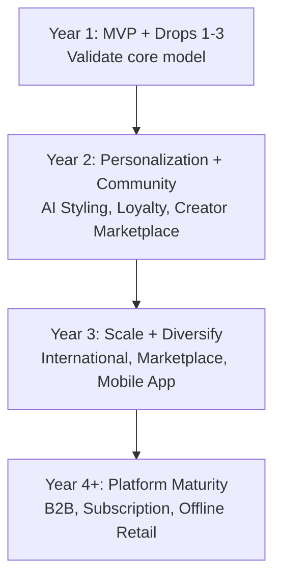

# Section 13 — Future Roadmap
### Jentara | Post-MVP Expansion Strategy

---

## 13.1 Roadmap Overview

| Horizon | Theme | Key Initiatives |
|---|---|---|
| Now → Month 12 | Validate | MVP platform, Drops 1–3, loyalty (basic), core retention loops |
| Year 2 | Personalize & Deepen Community | AI Styling Assistant, Virtual Try-On, Creator Marketplace, full Loyalty tiers |
| Year 3 | Scale & Diversify Channels | Native Mobile App, International/Diaspora expansion, Marketplace listings |
| Year 4+ | Platform Maturity | B2B/wholesale, Subscription drop-box, Offline flagship/pop-up stores |

## 13.2 AI Features

| Feature | Description | Value |
|---|---|---|
| AI Styling Assistant | Conversational/quiz-based styling recommendations using purchase + browsing history | Addresses sizing/styling uncertainty pain point (Section 3.7); increases AOV via cross-sell |
| Virtual Try-On | AR-based or AI-rendered try-on preview on PDP | Reduces return rate from fit mismatch, increases purchase confidence |
| Personalized Drop Alerts | ML-ranked notification priority based on affinity to past collections (e.g., mythology theme preference) | Improves restock/waitlist conversion efficiency |
| Demand Forecasting | ML-assisted inventory planning per drop based on waitlist signals and past sell-through | Reduces overproduction (reinforces sustainability positioning) |

## 13.3 International Expansion

| Phase | Market Focus | Considerations |
|---|---|---|
| Phase 1 | NRI/Diaspora (US, UK, UAE, Canada) via existing platform + international shipping | Currency/payment gateway expansion beyond Razorpay's India-first flows (e.g., adding an international-capable gateway alongside Razorpay), customs/duties messaging |
| Phase 2 | Direct international marketing in diaspora-dense metro areas | Localized creator partnerships, region-specific drop timing |
| Phase 3 | Broader global streetwear market | Requires dedicated logistics partners, potentially regional warehousing |

## 13.4 Marketplace Expansion

| Initiative | Description |
|---|---|
| Third-Party Aligned Brands | Curated marketplace section featuring complementary sustainable/heritage-aligned brands (commission model) |
| Creator-Designed Capsules | Marketplace slots for creator co-designed limited capsules, extending the affiliate relationship (Section 4.11) into product partnerships |

## 13.5 Native Mobile App

| Rationale | Detail |
|---|---|
| Why post-MVP | Mobile-web (responsive Next.js) covers Year 1 needs; app investment is justified once repeat-usage patterns justify app-install friction |
| Key App-Only Features (planned) | Push notifications for drop-live alerts (higher engagement than email/web push), app-exclusive early access windows, AR virtual try-on (better native camera/AR support) |

## 13.6 B2B / Wholesale

| Opportunity | Description |
|---|---|
| Boutique Wholesale | Selective wholesale partnerships with curated fashion boutiques/concept stores aligned with brand positioning |
| Corporate/Creator Gifting | Bulk order capability for corporate gifting or creator-community merch drops |

## 13.7 Creator Platform Expansion

| Initiative | Description |
|---|---|
| Creator Marketplace Dashboard | Self-serve dashboard for creators to generate affiliate links, track earnings, request co-design collabs |
| Tiered Creator Program | Formalized tiers (Nano/Micro/Macro) with escalating commission and early-access perks, building on Section 11.6 |

## 13.8 Subscription Model

| Concept | Description |
|---|---|
| "Constellation Club" Drop Box | Quarterly curated box for top loyalty-tier members — guaranteed access to limited pieces before public drop |
| Predictable Revenue Layer | Adds recurring revenue on top of drop-based GMV, improving revenue predictability for future fundraising |

## 13.9 Offline Stores

| Format | Description |
|---|---|
| Pop-Up Activations (continued from Section 11.12) | Scaled up from single-city pop-ups to multi-city pop-up tour tied to major drops |
| Flagship Store (Year 3+) | Experiential flagship in a Tier-1 city — showroom for storytelling/lore experience, not just retail |

## 13.10 Roadmap Prioritization (RICE-style Rationale)

| Initiative | Reach | Impact | Confidence | Effort | Priority Signal |
|---|---|---|---|---|---|
| AI Styling Assistant | High | High | Medium | High | Year 2, early |
| Loyalty Program (full tiers) | High | High | High | Medium | Year 2, early |
| Creator Marketplace | Medium | High | Medium | High | Year 2, mid |
| Virtual Try-On | Medium | Medium | Low (tech maturity risk) | High | Year 2, late / Year 3 |
| International Expansion | Medium | High | Medium | High | Year 3 |
| Native Mobile App | High | Medium | High | Medium | Year 3 |
| Subscription Drop Box | Low-Medium | Medium | Medium | Medium | Year 3+ |
| B2B/Wholesale | Low | Medium | Low | Medium | Year 4+ |
| Offline Flagship | Low | Medium | Low | High | Year 4+ |

---
**Previous section:** [`12-Finance`](../12-Finance/Finance.md)
**Next section:** [`14-Launch`](../14-Launch/Launch-and-Appendix.md)
