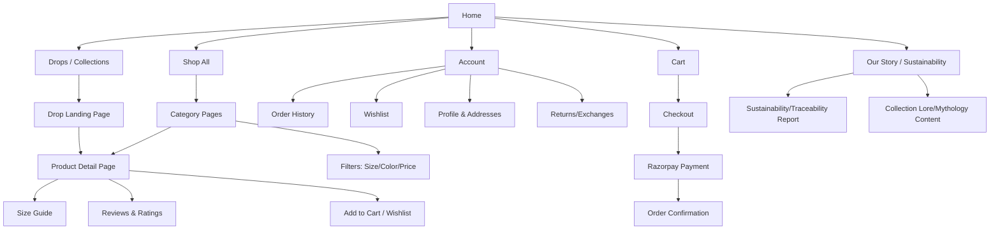
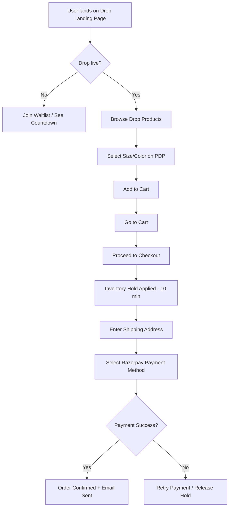
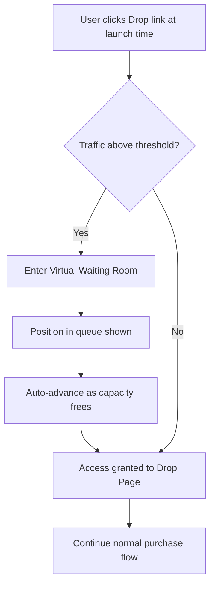
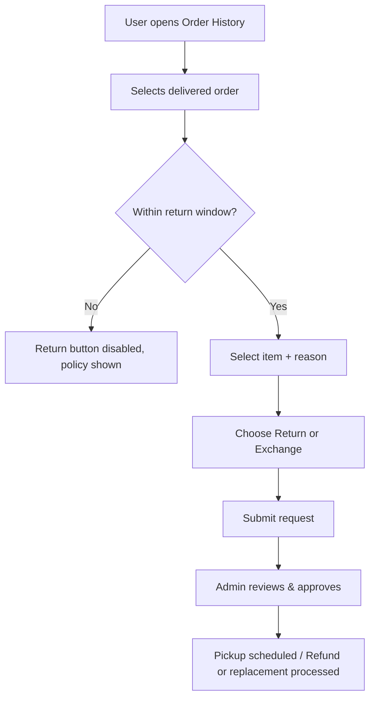

# Section 6 — UX
### Jentara | Information Architecture, Flows & Design System

---

## 6.1 Information Architecture

## 6.2 Site Map (Flat View)

| Level 1 | Level 2 | Level 3 |
|---|---|---|
| Home | — | — |
| Drops | Upcoming Drop (countdown) | Drop Product Listing |
| Shop All | Category (Tees / Hoodies / Accessories) | Product Detail Page |
| Our Story | Sustainability Report | Vendor Traceability Detail |
| Our Story | Brand Lore | Collection-specific Mythology Pages |
| Account | Orders, Wishlist, Profile, Returns | Order Detail, Return Request Form |
| Cart | Checkout | Payment (Razorpay), Confirmation |
| Support | FAQ, Contact, Size Guide | — |
| Admin (internal) | Products, Orders, Inventory, Analytics | Product Editor, Order Detail, Stock Editor |

## 6.3 Primary Navigation

**Header (Desktop):** Logo | Drops | Shop All | Our Story | Search | Wishlist | Account | Cart
**Header (Mobile):** Hamburger Menu | Logo | Search | Cart
**Mobile Menu:** Drops → Shop All → Our Story → Account → Support

**Footer:** About, Sustainability Report, Size Guide, Shipping & Returns Policy, Contact/Support, Instagram/creator links, Payment method badges (Razorpay-supported: UPI, Cards, Netbanking, Wallets)

## 6.4 Key User Flows

### Flow 1: Drop Purchase (Happy Path)

### Flow 2: High-Traffic Drop with Queueing

### Flow 3: Return/Exchange Request

## 6.5 Wireframes — Low Fidelity (Structural Description)

Since this document is text/diagram-based, low-fidelity wireframes are described structurally (ready to be built directly in Figma from this spec):

**Home Page (Mobile, 375px):**
1. Sticky header (logo, search icon, cart icon)
2. Full-bleed hero banner — current/upcoming drop visual + countdown
3. Horizontal scroll: "Shop the Story" (collection tiles with mythology theme names)
4. Grid: Best sellers (2 columns)
5. Sustainability banner (single CTA to traceability report)
6. Instagram UGC strip (creator content)
7. Footer with policy links

**Product Detail Page (PDP):**
1. Image carousel (swipeable, pinch-zoom)
2. Product title, price, limited-edition badge (if applicable, e.g., "120 of 500 remaining")
3. Size selector + "Find my size" link → size guide modal
4. Add to Cart / Wishlist buttons (sticky on mobile scroll)
5. Collapsible sections: Story/Lore, Fabric & Care, Sustainability Sourcing, Shipping & Returns
6. Reviews & ratings section
7. "You may also like" recommendation carousel

## 6.6 Wireframes — High Fidelity Direction

| Element | Direction |
|---|---|
| Color usage | Bold accent colors reserved for CTAs and scarcity indicators (e.g., "only 12 left"); base palette kept neutral/premium (see 6.9) |
| Typography | Editorial, confident headline type for storytelling sections; clean sans-serif for functional UI (cart, checkout, forms) |
| Imagery | Full-bleed, cinematic product photography with mythology/constellation art direction — not flat product-on-white catalog shots for hero/PDP top |
| Motion | Subtle parallax on hero, smooth countdown ticking, satisfying micro-animation on "Add to Cart" |

## 6.7 Micro-Interactions

| Interaction | Behavior |
|---|---|
| Add to Cart | Button morphs to checkmark + mini cart preview slides in from right |
| Wishlist toggle | Heart icon fills with animated pulse |
| Countdown timer | Digits flip/roll on each second change (drop urgency reinforcement) |
| Low stock indicator | Subtle pulsing badge ("Only 5 left") appears once stock < threshold |
| Payment processing | Razorpay modal loading state with branded skeleton, not generic spinner |
| Form validation | Inline, real-time validation (e.g., address/pincode) rather than only on submit |
| Waiting room | Live-updating queue position number with reassuring progress bar |

## 6.8 Accessibility

| Requirement | Implementation Note |
|---|---|
| WCAG 2.1 AA color contrast | All text/background combinations tested, especially over hero imagery |
| Keyboard navigation | Full tab-order support across nav, PDP, cart, checkout, Razorpay modal focus trap |
| Screen reader support | Semantic HTML, ARIA labels on icon-only buttons (cart, wishlist, search) |
| Alt text | Mandatory alt text field for all product images in admin panel (enforced at CMS level) |
| Form errors | Announced via `aria-live` regions, not color-only indication |
| Motion sensitivity | Respect `prefers-reduced-motion` for countdown/parallax animations |

## 6.9 Responsive Design

| Breakpoint | Target Devices | Layout Notes |
|---|---|---|
| 320–480px | Small mobile | Single column, sticky add-to-cart bar, collapsed filters (bottom sheet) |
| 481–768px | Large mobile / small tablet | Single-to-two column product grids |
| 769–1024px | Tablet | Two-to-three column grids, persistent filter sidebar |
| 1025px+ | Desktop | Full nav, three-to-four column grids, hover-state product previews |

## 6.10 Design System

### 6.10.1 Typography

| Role | Font Style | Usage |
|---|---|---|
| Display/Headline | Bold, editorial serif or high-contrast display sans | Hero banners, drop titles, storytelling sections |
| Body | Clean grotesque sans-serif | Product descriptions, UI copy, forms |
| UI/Labels | Medium-weight sans, slightly condensed | Buttons, tags, badges, navigation |

### 6.10.2 Spacing System (8px base grid)

| Token | Value | Usage |
|---|---|---|
| `space-xs` | 4px | Icon padding, tight inline gaps |
| `space-sm` | 8px | Form field padding |
| `space-md` | 16px | Card padding, standard gaps |
| `space-lg` | 24px | Section internal spacing |
| `space-xl` | 40px | Section-to-section spacing |
| `space-2xl` | 64px | Hero/major section breaks |

### 6.10.3 Color System

| Token | Role | Notes |
|---|---|---|
| `--color-ink` | Primary text / near-black | High contrast base |
| `--color-canvas` | Background / off-white | Premium, not stark white |
| `--color-accent-cosmic` | Primary brand accent (deep indigo/violet) | Evokes constellation/cosmic theme |
| `--color-accent-heritage` | Secondary accent (warm terracotta/gold) | Evokes mythology/heritage theme |
| `--color-scarcity` | Alert/urgency (amber-red) | "Low stock", countdown, limited badges |
| `--color-success` | Confirmation states | Order confirmed, payment success |
| `--color-border` | Neutral dividers/borders | Subtle, low-contrast |

### 6.10.4 Core Components

| Component | States Required |
|---|---|
| Button (Primary/Secondary/Ghost) | Default, Hover, Active, Disabled, Loading |
| Product Card | Default, Low-Stock badge, Sold-Out overlay |
| Size Selector | Default, Selected, Out-of-Stock (strikethrough) |
| Countdown Timer | Standard, Urgent (< 1hr, color shifts to `--color-scarcity`) |
| Toast/Notification | Success, Error, Info |
| Modal (Size Guide, Razorpay Checkout) | Default, Loading, Error |
| Badge | "Limited Edition", "New Drop", "Only X Left", "Sold Out" |
| Form Input | Default, Focus, Error, Disabled |

---
**Previous section:** [`05-PRD`](../05-PRD/PRD.md)
**Next section:** [`07-Architecture`](../07-Architecture/Architecture.md)
